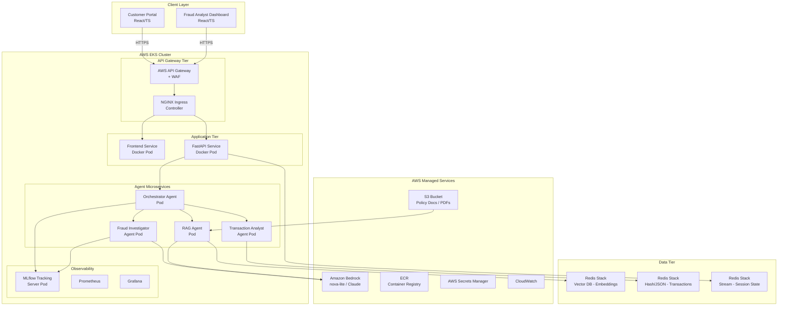
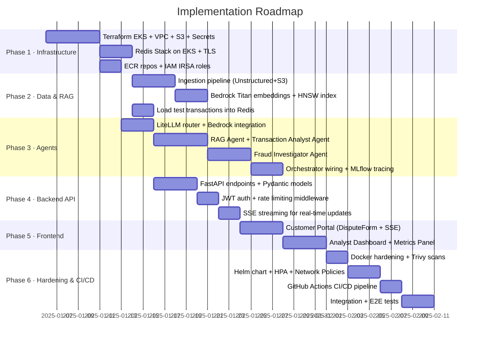

# Enterprise Customer Support & Fraud Resolution System
## Production-Grade Proof-of-Concept Implementation Plan

---

## 1. High-Level Architecture Diagram



---

## 2. Repository Structure

```
fraud-resolution-system/
├── .github/
│   └── workflows/
│       ├── ci.yml                    # Lint, test, build
│       └── cd.yml                    # Push to ECR, deploy to EKS
├── infra/
│   ├── terraform/
│   │   ├── modules/
│   │   │   ├── eks/                  # EKS cluster, node groups, IRSA roles
│   │   │   ├── bedrock/              # Bedrock model access, IAM
│   │   │   ├── redis/                # ElastiCache or Redis on EKS
│   │   │   ├── s3/                   # Bucket + lifecycle + encryption
│   │   │   └── secrets/              # Secrets Manager resources
│   │   ├── main.tf
│   │   ├── variables.tf
│   │   └── outputs.tf
│   └── helm/
│       ├── fraud-system/             # Umbrella Helm chart
│       │   ├── Chart.yaml
│       │   ├── values.yaml
│       │   ├── values-prod.yaml
│       │   └── templates/
│       │       ├── backend-deployment.yaml
│       │       ├── frontend-deployment.yaml
│       │       ├── agent-deployments.yaml
│       │       ├── mlflow-deployment.yaml
│       │       ├── ingress.yaml
│       │       ├── hpa.yaml
│       │       └── network-policy.yaml
├── backend/
│   ├── Dockerfile
│   ├── pyproject.toml
│   ├── app/
│   │   ├── main.py                   # FastAPI app factory
│   │   ├── config.py                 # Pydantic Settings v2
│   │   ├── api/
│   │   │   ├── v1/
│   │   │   │   ├── disputes.py       # POST /api/v1/dispute
│   │   │   │   ├── dashboard.py      # GET /api/v1/cases (analyst view)
│   │   │   │   ├── health.py         # GET /health, /ready
│   │   │   │   └── webhooks.py       # Internal agent callbacks
│   │   │   └── deps.py               # Auth, DB session injection
│   │   ├── models/
│   │   │   ├── dispute.py            # Pydantic I/O models
│   │   │   ├── transaction.py
│   │   │   └── agent_result.py
│   │   ├── services/
│   │   │   ├── orchestrator.py       # Kicks off agent pipeline
│   │   │   ├── redis_client.py       # redis-py + Redis OM config
│   │   │   └── session.py            # Redis Streams session state
│   │   └── middleware/
│   │       ├── auth.py               # JWT + AWS Cognito validation
│   │       ├── rate_limit.py         # Token-bucket rate limiter
│   │       └── logging.py            # Structured JSON logging
├── agents/
│   ├── Dockerfile
│   ├── pyproject.toml
│   ├── orchestrator/
│   │   ├── agent.py                  # OpenAI Agents SDK Orchestrator
│   │   └── tools.py                  # Tool definitions for sub-agents
│   ├── rag_agent/
│   │   ├── agent.py                  # RAG agent logic
│   │   ├── ingestion/
│   │   │   ├── pipeline.py           # Unstructured.io → embeddings → Redis
│   │   │   └── s3_loader.py          # S3 document fetch
│   │   └── retriever.py              # Redis VSS similarity search
│   ├── transaction_analyst/
│   │   ├── agent.py
│   │   └── tools.py                  # Redis Hash/JSON query tools
│   ├── fraud_investigator/
│   │   ├── agent.py
│   │   ├── 1            # Heuristic + LLM risk scoring
│   │   └── tools.py
│   └── shared/
│       ├── litellm_client.py         # LiteLLM router config
│       ├── mlflow_tracker.py         # MLflow logging helpers
│       └── pydantic_models.py        # Shared inter-agent schemas
├── frontend/
│   ├── Dockerfile
│   ├── package.json
│   ├── tsconfig.json
│   ├── vite.config.ts
│   └── src/
│       ├── main.tsx
│       ├── App.tsx
│       ├── portals/
│       │   ├── customer/
│       │   │   ├── DisputeForm.tsx
│       │   │   ├── DisputeStatus.tsx
│       │   │   └── TransactionList.tsx
│       │   └── analyst/
│       │       ├── CaseDashboard.tsx
│       │       ├── CaseDetail.tsx
│       │       ├── AgentMetricsPanel.tsx
│       │       └── RiskHeatmap.tsx
│       ├── api/
│       │   ├── disputeApi.ts
│       │   └── dashboardApi.ts
│       ├── hooks/
│       │   ├── useDisputeSubmit.ts
│       │   └── useCaseStream.ts      # SSE hook for real-time updates
│       └── types/
│           └── models.ts
├── ingestion/
│   ├── Dockerfile
│   └── pipeline/
│       ├── main.py                   # One-shot / scheduled ingestion
│       ├── unstructured_parser.py    # Unstructured.io API calls
│       ├── embedder.py               # Bedrock Titan Embeddings
│       └── redis_indexer.py          # HNSW index creation
├── mlflow_server/
│   ├── Dockerfile
│   └── mlflow_config.yaml
├── tests/
│   ├── unit/
│   ├── integration/
│   └── e2e/
└── docs/
    └── architecture.md
```

---

## 3. Infrastructure Layer (Terraform + EKS)

### 3.1 EKS Cluster Configuration

```hcl
# infra/terraform/modules/eks/main.tf

module "eks" {
  source  = "terraform-aws-modules/eks/aws"
  version = "~> 20.0"

  cluster_name    = "fraud-resolution-eks"
  cluster_version = "1.30"

  # Private API endpoint — no public exposure
  cluster_endpoint_public_access  = false
  cluster_endpoint_private_access = true

  vpc_id     = var.vpc_id
  subnet_ids = var.private_subnet_ids

  # IRSA — pods assume IAM roles without static credentials
  enable_irsa = true

  eks_managed_node_groups = {
    system = {
      instance_types = ["m6i.large"]
      min_size       = 2
      max_size       = 4
      desired_size   = 2
      labels         = { workload = "system" }
    }
    agents = {
      instance_types = ["m6i.xlarge"]
      min_size       = 2
      max_size       = 10
      desired_size   = 3
      labels         = { workload = "agent" }
      taints         = [{ key = "workload", value = "agent", effect = "NO_SCHEDULE" }]
    }
  }

  # Enable envelope encryption for etcd secrets
  cluster_encryption_config = {
    provider_key_arn = aws_kms_key.eks.arn
    resources        = ["secrets"]
  }
}

# IRSA role for Bedrock + S3 access by agent pods
resource "aws_iam_role" "agent_pod_role" {
  name = "fraud-agent-pod-role"
  assume_role_policy = jsonencode({
    Version = "2012-10-17"
    Statement = [{
      Action = "sts:AssumeRoleWithWebIdentity"
      Effect = "Allow"
      Principal = {
        Federated = module.eks.oidc_provider_arn
      }
      Condition = {
        StringEquals = {
          "${module.eks.oidc_provider}:sub" = "system:serviceaccount:fraud-system:agent-sa"
        }
      }
    }]
  })
}

resource "aws_iam_role_policy" "agent_bedrock" {
  role = aws_iam_role.agent_pod_role.id
  policy = jsonencode({
    Version = "2012-10-17"
    Statement = [
      {
        Effect   = "Allow"
        Action   = ["bedrock:InvokeModel", "bedrock:InvokeModelWithResponseStream"]
        # Scope to specific model ARNs — principle of least privilege
        Resource = [
          "arn:aws:bedrock:${var.region}::foundation-model/amazon.nova-lite-v1:0",
          "arn:aws:bedrock:${var.region}::foundation-model/amazon.titan-embed-text-v2:0"
        ]
      },
      {
        Effect   = "Allow"
        Action   = ["s3:GetObject", "s3:ListBucket"]
        Resource = [
          "arn:aws:s3:::${var.policy_docs_bucket}",
          "arn:aws:s3:::${var.policy_docs_bucket}/*"
        ]
      }
    ]
  })
}
```

### 3.2 S3 Bucket (Policy Documents — Hardened)

```hcl
# infra/terraform/modules/s3/main.tf

resource "aws_s3_bucket" "policy_docs" {
  bucket        = "fraud-system-policy-docs-${var.account_id}"
  force_destroy = false
}

resource "aws_s3_bucket_versioning" "policy_docs" {
  bucket = aws_s3_bucket.policy_docs.id
  versioning_configuration { status = "Enabled" }
}

resource "aws_s3_bucket_server_side_encryption_configuration" "policy_docs" {
  bucket = aws_s3_bucket.policy_docs.id
  rule {
    apply_server_side_encryption_by_default {
      sse_algorithm     = "aws:kms"
      kms_master_key_id = aws_kms_key.s3.arn
    }
  }
}

resource "aws_s3_bucket_public_access_block" "policy_docs" {
  bucket                  = aws_s3_bucket.policy_docs.id
  block_public_acls       = true
  block_public_policy     = true
  ignore_public_acls      = true
  restrict_public_buckets = true
}
```

---

## 4. Data Tier — Redis Stack (Dual-Mode)

Redis Stack serves as both the **Vector Database** (RedisSearch + HNSW index) and the **Relational/State store** (Redis JSON + Hashes + Streams).

### 4.1 Redis Kubernetes Deployment

```yaml
# infra/helm/fraud-system/templates/redis-statefulset.yaml
apiVersion: apps/v1
kind: StatefulSet
metadata:
  name: redis-stack
spec:
  serviceName: redis-stack
  replicas: 1   # Scale to Redis Cluster (6 nodes) for production
  selector:
    matchLabels:
      app: redis-stack
  template:
    spec:
      containers:
        - name: redis-stack
          image: redis/redis-stack-server:7.4.0-v1
          ports:
            - containerPort: 6379
          env:
            - name: REDIS_ARGS
              value: "--requirepass $(REDIS_PASSWORD) --tls-port 6380 --tls-cert-file /tls/tls.crt --tls-key-file /tls/tls.key --loglevel warning"
          envFrom:
            - secretRef:
                name: redis-credentials
          volumeMounts:
            - name: redis-data
              mountPath: /data
            - name: tls-certs
              mountPath: /tls
              readOnly: true
  volumeClaimTemplates:
    - metadata:
        name: redis-data
      spec:
        accessModes: ["ReadWriteOnce"]
        storageClassName: gp3-encrypted
        resources:
          requests:
            storage: 50Gi
```

### 4.2 Redis Client & Redis OM Configuration

```python
# backend/app/services/redis_client.py
from redis.asyncio import Redis
from redis_om import get_redis_connection, JsonModel, Field
from app.config import settings

# Async client for FastAPI
async_redis: Redis = Redis(
    host=settings.REDIS_HOST,
    port=settings.REDIS_TLS_PORT,
    password=settings.REDIS_PASSWORD,
    ssl=True,
    ssl_certfile=settings.REDIS_TLS_CERT,
    ssl_keyfile=settings.REDIS_TLS_KEY,
    ssl_ca_certs=settings.REDIS_CA_CERT,
    decode_responses=True,
    max_connections=50,
)

# Synchronous client for Redis OM models
sync_redis = get_redis_connection(
    host=settings.REDIS_HOST,
    port=settings.REDIS_TLS_PORT,
    password=settings.REDIS_PASSWORD,
    ssl=True,
    decode_responses=True,
)


# ── Redis OM: Relational Model ────────────────────────────────────────────────
class TransactionRecord(JsonModel):
    """Stored as JSON in Redis; indexed for search."""
    customer_id: str = Field(index=True)
    transaction_id: str = Field(index=True)
    merchant_name: str = Field(index=True, full_text_search=True)
    amount_usd: float
    timestamp_utc: str = Field(index=True)
    category: str = Field(index=True)
    status: str = Field(index=True)   # APPROVED | DISPUTED | REVERSED
    geolocation: str

    class Meta:
        database = sync_redis
        global_key_prefix = "txn"
        encoding = "utf-8"


class DisputeCase(JsonModel):
    """Tracks the full lifecycle of a dispute case."""
    case_id:           str   = Field(index=True)
    customer_id:       str   = Field(index=True)
    transaction_id:    str   = Field(index=True)
    status:            str   = Field(index=True)
    risk_score:        float = Field(index=True, default=0.0)
    risk_level:        str   = Field(default="")
    resolution_action: str   = Field(default="")
    agent_rationale:   str   = Field(default="")
    assigned_analyst:  str   = Field(default="")
    resolved_by:       str   = Field(default="")
    created_at:        str   = Field(default="")
    updated_at:        str   = Field(default="")

    class Meta:
        database          = sync_redis
        global_key_prefix = "dispute"
```

### 4.3 Vector Index Creation (HNSW for Policy Search)

```python
# ingestion/pipeline/redis_indexer.py
import redis
from redis.commands.search.field import VectorField, TagField, TextField
from redis.commands.search.indexDefinition import IndexDefinition, IndexType

def create_policy_vector_index(r: redis.Redis) -> None:
    """
    Creates a Redis HNSW index for semantic policy search.
    Embedding dim=1536 matches Amazon Titan Embed Text v2.
    """
    schema = (
        TagField("$.doc_id",       as_name="doc_id"),
        TagField("$.policy_type",  as_name="policy_type"),
        TextField("$.chunk_text",  as_name="chunk_text"),
        VectorField(
            "$.embedding",
            "HNSW",
            {
                "TYPE":            "FLOAT32",
                "DIM":             1536,
                "DISTANCE_METRIC": "COSINE",
                "M":               16,
                "EF_CONSTRUCTION": 200,
                "EF_RUNTIME":      10,
            },
            as_name="embedding",
        ),
    )
    definition = IndexDefinition(
        prefix=["policy:chunk:"],
        index_type=IndexType.JSON,
    )
    try:
        r.ft("policy_idx").create_index(schema, definition=definition)
    except redis.exceptions.ResponseError as e:
        if "Index already exists" not in str(e):
            raise
```

---

## 5. RAG Ingestion Pipeline (Unstructured.io + S3 + Bedrock Embeddings)

### 5.1 Document Parser

```python
# ingestion/pipeline/unstructured_parser.py
import boto3
from unstructured.partition.auto import partition
from unstructured.chunking.title import chunk_by_title
from unstructured.documents.elements import CompositeElement
from pathlib import Path
import tempfile
from typing import Generator

s3_client = boto3.client("s3")


def stream_s3_documents(bucket: str, prefix: str = "compliance/") -> Generator[dict, None, None]:
    """
    Streams objects from S3, partitions with Unstructured.io,
    chunks by semantic title boundaries, and yields text chunks.
    """
    paginator = s3_client.get_paginator("list_objects_v2")
    for page in paginator.paginate(Bucket=bucket, Prefix=prefix):
        for obj in page.get("Contents", []):
            key = obj["Key"]
            if not key.lower().endswith((".pdf", ".docx", ".html")):
                continue

            with tempfile.NamedTemporaryFile(suffix=Path(key).suffix) as tmp:
                s3_client.download_fileobj(bucket, key, tmp)
                tmp.flush()

                # Unstructured.io auto-detects file type, handles tables + figures
                elements = partition(
                    filename=tmp.name,
                    strategy="hi_res",           # OCR + layout analysis for PDFs
                    infer_table_structure=True,   # Preserves table semantics
                    languages=["eng"],
                )

            # Chunk by document sections for coherent RAG retrieval
            chunks: list[CompositeElement] = chunk_by_title(
                elements,
                max_characters=1024,
                new_after_n_chars=768,
                combine_text_under_n_chars=200,
            )

            for i, chunk in enumerate(chunks):
                yield {
                    "doc_id":      key,
                    "chunk_index": i,
                    "policy_type": _classify_policy_type(key),
                    "chunk_text":  str(chunk),
                    "source_s3":   f"s3://{bucket}/{key}",
                }


def _classify_policy_type(key: str) -> str:
    key_lower = key.lower()
    if "chargeback" in key_lower:   return "chargeback"
    if "fraud"      in key_lower:   return "fraud"
    if "kyc"        in key_lower:   return "kyc"
    if "aml"        in key_lower:   return "aml"
    return "general"
```

### 5.2 Bedrock Embedding + Redis Indexing

```python
# ingestion/pipeline/embedder.py
import boto3, json, struct
from typing import List

bedrock = boto3.client("bedrock-runtime", region_name="us-east-1")

def embed_text(text: str) -> List[float]:
    """
    Amazon Titan Embed Text v2 — 1536-dim embeddings.
    Normalized for cosine similarity.
    """
    body = json.dumps({
        "inputText":    text,
        "dimensions":   1536,
        "normalize":    True,
    })
    response = bedrock.invoke_model(
        modelId    = "amazon.titan-embed-text-v2:0",
        body       = body,
        contentType= "application/json",
        accept     = "application/json",
    )
    return json.loads(response["body"].read())["embedding"]
```

```python
# ingestion/pipeline/main.py
import redis
import json
import struct
from ingestion.pipeline.embedder           import embed_text
from ingestion.pipeline.unstructured_parser import stream_s3_documents
from ingestion.pipeline.redis_indexer       import create_policy_vector_index
from app.config import settings

def run_ingestion_pipeline(bucket: str) -> None:
    r = redis.Redis(
        host             = settings.REDIS_HOST,
        port             = settings.REDIS_TLS_PORT,
        password         = settings.REDIS_PASSWORD,
        ssl              = True,
        decode_responses = False,
    )
    create_policy_vector_index(r)
    pipe              = r.pipeline(transaction=False)
    batch_size, count = 25, 0

    for chunk in stream_s3_documents(bucket):
        embedding = embed_text(chunk["chunk_text"])
        key       = f"policy:chunk:{chunk['doc_id']}:{chunk['chunk_index']}"
        payload   = {
            "doc_id":      chunk["doc_id"],
            "policy_type": chunk["policy_type"],
            "chunk_text":  chunk["chunk_text"],
            "source_s3":   chunk["source_s3"],
            "embedding":   struct.pack(f"{len(embedding)}f", *embedding),
        }
        pipe.json().set(key, "$", payload)
        count += 1
        if count % batch_size == 0:
            pipe.execute()
            pipe = r.pipeline(transaction=False)
            print(f"Ingested {count} chunks...")

    pipe.execute()
    print(f"Ingestion complete. Total chunks: {count}")
```

---

## 6. Agent Framework (OpenAI SDK + LiteLLM + Amazon Bedrock)

### 6.1 LiteLLM Router Configuration

```python
# agents/shared/litellm_client.py
from litellm import Router

# LiteLLM acts as a unified interface between OpenAI SDK and Bedrock
router = Router(
    model_list=[
        {
            "model_name":  "primary-llm",   # Logical name used by agents
            "litellm_params": {
                "model":        "bedrock/amazon.nova-lite-v1:0",
                "aws_region_name": "us-east-1",
                # IRSA — no static keys; boto3 uses pod's IAM role
            },
        },
        {
            # Fallback to Claude Haiku if Nova-Lite quota exceeded
            "model_name":  "primary-llm",
            "litellm_params": {
                "model":        "bedrock/anthropic.claude-3-haiku-20240307-v1:0",
                "aws_region_name": "us-east-1",
            },
        },
    ],
    fallbacks=[{"primary-llm": ["primary-llm"]}],
    num_retries=3,
    retry_after=2,
    allowed_fails=2,
    routing_strategy="least-busy",
    set_verbose=False,
)
```

### 6.2 Orchestrator Agent

```python
# agents/orchestrator/agent.py
from agents import Agent, Runner, handoff, trace
from agents.extensions.litellm import LiteLLMModel
from agents.shared.litellm_client import router
from agents.shared.mlflow_tracker import MLflowSpanTracker
from agents.shared.pydantic_models import DisputeRequest, FraudResolutionResult
from agents.rag_agent.agent import rag_agent
from agents.transaction_analyst.agent import transaction_analyst_agent
from agents.fraud_investigator.agent import fraud_investigator_agent


_llm = LiteLLMModel(model_id="primary-llm", router=router)

orchestrator_agent = Agent(
    name="OrchestratorAgent",
    model=_llm,
    instructions="""
    You are the master orchestration agent for a banking fraud resolution system.
    Your job is to coordinate specialist agents to evaluate customer transaction disputes.

    Workflow (STRICTLY follow this order):
    1. Hand off to RAG Agent with the dispute description to retrieve relevant policy rules.
    2. Hand off to Transaction Analyst Agent with customer_id and the dispute window to fetch transaction history.
    3. Hand off to Fraud Investigator Agent with BOTH payloads (policy rules + transactions) to assess risk.
    4. Return the Fraud Investigator's structured FraudResolutionResult.

    NEVER skip steps. NEVER make a fraud determination yourself.
    All final decisions are made by the Fraud Investigator Agent.
    """,
    handoffs=[
        handoff(rag_agent,                 tool_name="get_policy_rules"),
        handoff(transaction_analyst_agent, tool_name="get_transaction_history"),
        handoff(fraud_investigator_agent,  tool_name="assess_fraud_risk"),
    ],
    output_type=FraudResolutionResult,
)


async def run_dispute_pipeline(
    dispute: DisputeRequest,
    tracker: MLflowSpanTracker,
) -> FraudResolutionResult:
    with trace("dispute_pipeline", metadata={"case_id": dispute.case_id}):
        result = await Runner.run(
            orchestrator_agent,
            input=dispute.model_dump_json(),
        )
    tracker.log_agent_run(result)
    return result.final_output
```

### 6.3 RAG Agent

```python
# agents/rag_agent/agent.py
from agents import Agent, function_tool
from agents.extensions.litellm import LiteLLMModel
from agents.shared.litellm_client import router
from .retriever import PolicyRetriever

_llm = LiteLLMModel(model_id="primary-llm", router=router)
_retriever = PolicyRetriever()


@function_tool
def search_policy_knowledge_base(query: str, top_k: int = 5) -> str:
    """
    Perform semantic vector search in Redis to retrieve bank policy
    chunks most relevant to the given dispute query.
    Returns formatted policy excerpts with source citations.
    """
    results = _retriever.search(query=query, top_k=top_k)
    if not results:
        return "No relevant policy documents found."
    formatted = "\n\n".join(
        f"[Source: {r['doc_id']} | Policy: {r['policy_type']}]\n{r['chunk_text']}"
        for r in results
    )
    return formatted


rag_agent = Agent(
    name="RAGPolicyAgent",
    model=_llm,
    instructions="""
    You are a banking compliance policy retrieval specialist.
    Given a dispute description, use the search_policy_knowledge_base tool
    to find all relevant chargeback timelines, fraud thresholds, and regulatory
    rules that apply. Return a concise structured summary of applicable policies
    with exact source citations. Do not invent policy rules.
    """,
    tools=[search_policy_knowledge_base],
)
```

### 6.4 Redis Vector Retriever

```python
# agents/rag_agent/retriever.py
import redis, struct, json
from redis.commands.search.query import Query
from ingestion.pipeline.embedder import embed_text
from app.config import settings


class PolicyRetriever:
    def __init__(self):
        self._r = redis.Redis(
            host=settings.REDIS_HOST,
            port=settings.REDIS_TLS_PORT,
            password=settings.REDIS_PASSWORD,
            ssl=True,
            decode_responses=False,
        )

    def search(self, query: str, top_k: int = 5) -> list[dict]:
        embedding = embed_text(query)
        query_bytes = struct.pack(f"{len(embedding)}f", *embedding)

        # KNN vector similarity search using HNSW index
        q = (
            Query(f"(*)=>[KNN {top_k} @embedding $vec AS score]")
            .sort_by("score")
            .return_fields("doc_id", "policy_type", "chunk_text", "source_s3", "score")
            .dialect(2)
        )
        results = self._r.ft("policy_idx").search(q, query_params={"vec": query_bytes})

        return [
            {
                "doc_id":      doc.doc_id,
                "policy_type": doc.policy_type,
                "chunk_text":  doc.chunk_text,
                "source_s3":   doc.source_s3,
                "score":       float(doc.score),
            }
            for doc in results.docs
        ]
```

### 6.5 Transaction Analyst Agent

```python
# agents/transaction_analyst/agent.py
import json
from agents import Agent, function_tool
from agents.extensions.litellm import LiteLLMModel
from agents.shared.litellm_client import router
from app.services.redis_client import TransactionRecord
from datetime import datetime, timedelta, timezone

_llm = LiteLLMModel(model_id="primary-llm", router=router)


@function_tool
def fetch_30_day_transactions(customer_id: str) -> str:
    """
    Fetches the last 30 days of transactions for a given customer
    from Redis JSON store. Returns structured JSON array.
    """
    cutoff = (datetime.now(timezone.utc) - timedelta(days=30)).isoformat()
    # Redis OM query — indexed field range search
    transactions = (
        TransactionRecord.find(
            (TransactionRecord.customer_id == customer_id) &
            (TransactionRecord.timestamp_utc >= cutoff)
        )
        .page(0, 100)   # Safety cap
    )
    return json.dumps([t.model_dump() for t in transactions], default=str)


transaction_analyst_agent = Agent(
    name="TransactionAnalystAgent",
    model=_llm,
    instructions="""
    You are a transaction data analyst for a banking fraud resolution system.
    Given a customer_id, retrieve their 30-day transaction history and produce
    a structured analysis: total spend, merchant frequency distribution, geographic
    patterns, and any anomalies (velocity spikes, unusual amounts, off-hours transactions).
    Return JSON-formatted output only.
    """,
    tools=[fetch_30_day_transactions],
)
```

### 6.6 Fraud Investigator Agent

```python
# agents/fraud_investigator/agent.py
from agents import Agent, function_tool
from agents.extensions.litellm import LiteLLMModel
from agents.shared.litellm_client import router
from agents.shared.pydantic_models import FraudResolutionResult, RiskLevel

_llm = LiteLLMModel(model_id="primary-llm", router=router)


fraud_investigator_agent = Agent(
    name="FraudInvestigatorAgent",
    model=_llm,
    instructions="""
    You are a senior fraud investigator AI. You receive:
    1. Applicable bank policy rules (from RAG Agent)
    2. Customer 30-day transaction analysis (from Transaction Analyst)
    3. The customer's original dispute claim

    Your task:
    - Assign a numeric risk_score between 0.0 (no fraud) and 1.0 (definite fraud)
    - Assign a risk_level: LOW (<0.35), MEDIUM (0.35-0.70), HIGH (>0.70)
    - Provide a detailed agent_rationale citing specific policy rules and transaction anomalies
    - Set resolution_action:
        * "AUTO_APPROVE" for risk_level == LOW
        * "ANALYST_REVIEW" for risk_level == MEDIUM or HIGH
    - List specific evidence_flags (e.g., "transaction 3hr after international purchase", "velocity >5 txn/hour")

    Produce ONLY a valid FraudResolutionResult JSON payload. No prose outside JSON.
    """,
    output_type=FraudResolutionResult,
)
```

### 6.7 Shared Pydantic Models

```python
# agents/shared/pydantic_models.py
from pydantic import BaseModel, Field, field_validator
from enum import Enum
from typing import Optional
import uuid


class RiskLevel(str, Enum):
    LOW    = "LOW"
    MEDIUM = "MEDIUM"
    HIGH   = "HIGH"


class ResolutionAction(str, Enum):
    AUTO_APPROVE    = "AUTO_APPROVE"
    ANALYST_REVIEW  = "ANALYST_REVIEW"


class DisputeRequest(BaseModel):
    case_id:           str          = Field(default_factory=lambda: str(uuid.uuid4()))
    customer_id:       str
    transaction_id:    str
    dispute_reason:    str          = Field(min_length=10, max_length=2000)
    dispute_amount_usd: float       = Field(gt=0.0)

    @field_validator("customer_id", "transaction_id")
    @classmethod
    def no_injection(cls, v: str) -> str:
        # Guard against Redis key injection / prompt injection via IDs
        allowed = set("abcdefghijklmnopqrstuvwxyzABCDEFGHIJKLMNOPQRSTUVWXYZ0123456789-_")
        if not all(c in allowed for c in v):
            raise ValueError("ID contains invalid characters")
        return v


class FraudResolutionResult(BaseModel):
    case_id:           str
    risk_score:        float            = Field(ge=0.0, le=1.0)
    risk_level:        RiskLevel
    resolution_action: ResolutionAction
    agent_rationale:   str
    evidence_flags:    list[str]        = Field(default_factory=list)
    applicable_policies: list[str]     = Field(default_factory=list)
    processing_time_ms: Optional[float] = None
```

---

## 7. FastAPI Backend

### 7.1 Application Factory

```python
# backend/app/main.py
from contextlib import asynccontextmanager
from fastapi import FastAPI
from fastapi.middleware.cors import CORSMiddleware
from app.api.v1 import disputes, dashboard, health
from app.middleware.auth import JWTAuthMiddleware
from app.middleware.rate_limit import RateLimitMiddleware
from app.middleware.logging import StructuredLoggingMiddleware
from app.services.redis_client import async_redis
from app.config import settings


@asynccontextmanager
async def lifespan(app: FastAPI):
    # Startup: verify Redis connectivity
    await async_redis.ping()
    yield
    # Shutdown: graceful close
    await async_redis.aclose()


app = FastAPI(
    title="Fraud Resolution API",
    version="1.0.0",
    docs_url=None,       # Disable Swagger UI in production
    redoc_url=None,
    lifespan=lifespan,
)

# Security headers — OWASP hardening
app.add_middleware(
    CORSMiddleware,
    allow_origins=settings.ALLOWED_ORIGINS,   # Strict allowlist
    allow_credentials=True,
    allow_methods=["GET", "POST"],
    allow_headers=["Authorization", "Content-Type", "X-Request-ID"],
)
app.add_middleware(JWTAuthMiddleware)
app.add_middleware(RateLimitMiddleware, max_requests=100, window_seconds=60)
app.add_middleware(StructuredLoggingMiddleware)

app.include_router(disputes.router,  prefix="/api/v1", tags=["disputes"])
app.include_router(dashboard.router, prefix="/api/v1", tags=["dashboard"])
app.include_router(health.router,    tags=["health"])
```

### 7.2 Dispute Endpoint

```python
# backend/app/api/v1/disputes.py
from fastapi import APIRouter, Depends, BackgroundTasks, HTTPException, status
from fastapi.responses import StreamingResponse
from app.models.dispute import DisputeRequest, DisputeResponse
from app.services.orchestrator import run_dispute_pipeline
from app.services.session import SessionService
from app.services.redis_client import async_redis
from app.api.deps import get_verified_customer
import json, time

router = APIRouter()


@router.post(
    "/dispute",
    response_model=DisputeResponse,
    status_code=status.HTTP_202_ACCEPTED,
)
async def submit_dispute(
    payload: DisputeRequest,
    background_tasks: BackgroundTasks,
    customer_id: str = Depends(get_verified_customer),
) -> DisputeResponse:
    """
    Accepts a transaction dispute from the Customer Portal.
    Enqueues agent pipeline asynchronously; returns case_id immediately.
    Customer polls GET /dispute/{case_id}/status for updates.
    """
    # Ensure customer can only dispute their own transactions
    if payload.customer_id != customer_id:
        raise HTTPException(
            status_code=status.HTTP_403_FORBIDDEN,
            detail="Cannot dispute transactions for a different account",
        )

    session = SessionService(async_redis)
    case_id = await session.create_case(payload)

    # Non-blocking: agent pipeline runs in background
    background_tasks.add_task(run_dispute_pipeline, payload, case_id)

    return DisputeResponse(
        case_id=case_id,
        status="PENDING",
        message="Dispute submitted. Processing initiated.",
    )


@router.get("/dispute/{case_id}/stream")
async def stream_case_status(
    case_id: str,
    customer_id: str = Depends(get_verified_customer),
) -> StreamingResponse:
    """
    Server-Sent Events stream for real-time case status updates.
    React frontend subscribes using EventSource API.
    """
    session = SessionService(async_redis)

    async def event_generator():
        async for event in session.stream_case_events(case_id, customer_id):
            yield f"data: {json.dumps(event)}\n\n"

    return StreamingResponse(
        event_generator(),
        media_type="text/event-stream",
        headers={
            "Cache-Control": "no-cache",
            "X-Accel-Buffering": "no",
        },
    )


```

### 7.3 Pydantic Settings

```python
# backend/app/config.py
from pydantic_settings import BaseSettings, SettingsConfigDict
from functools import lru_cache


class Settings(BaseSettings):
    # Redis
    REDIS_HOST:      str
    REDIS_TLS_PORT:  int   = 6380
    REDIS_PASSWORD:  str
    REDIS_TLS_CERT:  str
    REDIS_TLS_KEY:   str
    REDIS_CA_CERT:   str

    # AWS
    AWS_REGION:      str   = "us-east-1"

    # Auth
    COGNITO_USER_POOL_ID: str
    COGNITO_CLIENT_ID:    str
    ALLOWED_ORIGINS:      list[str] = ["https://portal.internal.bank.com"]

    # MLflow
    MLFLOW_TRACKING_URI: str

    model_config = SettingsConfigDict(
        env_file=".env",
        env_file_encoding="utf-8",
        secrets_dir="/var/run/secrets",  # Kubernetes secret volume mounts
    )


@lru_cache
def get_settings() -> Settings:
    return Settings()

settings = get_settings()
```

---

## 8. MLflow Observability

```python
# agents/shared/mlflow_tracker.py
import mlflow
import os
import time
from typing import Any

mlflow.set_tracking_uri(os.getenv("MLFLOW_TRACKING_URI", "http://mlflow.fraud-system.svc.cluster.local:5000"))


class MLflowSpanTracker:
    """
    Logs full agent execution metadata to MLflow.
    Each dispute invocation = 1 MLflow Run with nested spans.
    """
    def __init__(self, case_id: str):
        self.case_id   = case_id
        self.run       = None
        self._start_ms = time.monotonic() * 1000

    def __enter__(self):
        mlflow.set_experiment("fraud-resolution-agents")
        self.run = mlflow.start_run(run_name=f"dispute-{self.case_id}")
        mlflow.set_tags({
            "case_id":       self.case_id,
            "agent_version": "1.0.0",
            "env":           "production",
        })
        return self

    def log_agent_step(self, agent_name: str, prompt: str, response: str, tokens: dict) -> None:
        with mlflow.start_span(name=agent_name) as span:
            span.set_inputs({"prompt": prompt[:4000]})    # Truncate for storage limits
            span.set_outputs({"response": response[:4000]})
            mlflow.log_metrics({
                f"{agent_name}.prompt_tokens":     tokens.get("prompt_tokens", 0),
                f"{agent_name}.completion_tokens": tokens.get("completion_tokens", 0),
                f"{agent_name}.total_tokens":      tokens.get("total_tokens", 0),
            })

    def log_agent_run(self, result: Any) -> None:
        elapsed_ms = (time.monotonic() * 1000) - self._start_ms
        mlflow.log_metrics({
            "total_pipeline_latency_ms": elapsed_ms,
            "risk_score":               result.final_output.risk_score,
        })
        mlflow.log_param("resolution_action", result.final_output.resolution_action)
        mlflow.log_param("risk_level",        result.final_output.risk_level)

    def __exit__(self, *args):
        mlflow.end_run()
```

---

## 9. React Frontend

### 9.1 Type Definitions

```typescript
// frontend/src/types/models.ts
export type RiskLevel = "LOW" | "MEDIUM" | "HIGH";
export type ResolutionAction = "AUTO_APPROVE" | "ANALYST_REVIEW" | "APPROVED" | "DENIED";
export type CaseStatus = "PENDING" | "AUTO_APPROVED" | "ANALYST_REVIEW" | "IN_REVIEW" | "RESOLVED" | "CLOSED" | "ERROR";

export interface DisputeRequest {
  customer_id:        string;
  transaction_id:     string;
  dispute_reason:     string;
  dispute_amount_usd: number;
}

export interface DisputeResponse {
  case_id: string;
  status:  CaseStatus;
  message: string;
}

export interface FraudCase {
  case_id:             string;
  customer_id:         string;
  transaction_id:      string;
  status:              CaseStatus;
  risk_score:          number;
  risk_level:          RiskLevel;
  resolution_action:   ResolutionAction;
  agent_rationale:     string;
  evidence_flags:      string[];
  applicable_policies: string[];
  created_at:          string;
  assigned_analyst?:   string;
  resolved_by?:        string;
}
```

### 9.2 Customer Dispute Form

```tsx
// frontend/src/portals/customer/DisputeForm.tsx
import React, { useState } from "react";
import { useDisputeSubmit } from "../../hooks/useDisputeSubmit";
import { DisputeRequest } from "../../types/models";

export const DisputeForm: React.FC = () => {
  const [form, setForm] = useState<Partial<DisputeRequest>>({});
  const { submit, caseId, status, error, isLoading } = useDisputeSubmit();

  const handleSubmit = async (e: React.FormEvent) => {
    e.preventDefault();
    await submit(form as DisputeRequest);
  };

  if (caseId) {
    return (
      <div className="dispute-submitted">
        <h2>Dispute Submitted</h2>
        <p>Case ID: <code>{caseId}</code></p>
        <p>Status: <strong>{status}</strong></p>
        <p>You will receive an email update within 2 business days.</p>
      </div>
    );
  }

  return (
    <form onSubmit={handleSubmit} className="dispute-form">
      <h2>Report Unauthorized Transaction</h2>

      <label>Transaction ID
        <input
          type="text"
          required
          pattern="[a-zA-Z0-9\-_]+"
          onChange={e => setForm(f => ({ ...f, transaction_id: e.target.value }))}
        />
      </label>

      <label>Disputed Amount (USD)
        <input
          type="number"
          min="0.01"
          step="0.01"
          required
          onChange={e => setForm(f => ({ ...f, dispute_amount_usd: parseFloat(e.target.value) }))}
        />
      </label>

      <label>Describe what happened
        <textarea
          minLength={10}
          maxLength={2000}
          required
          onChange={e => setForm(f => ({ ...f, dispute_reason: e.target.value }))}
        />
      </label>

      {error && <p className="error-msg" role="alert">{error}</p>}

      <button type="submit" disabled={isLoading}>
        {isLoading ? "Submitting..." : "Submit Dispute"}
      </button>
    </form>
  );
};
```

### 9.3 SSE Hook for Real-Time Status

```typescript
// frontend/src/hooks/useCaseStream.ts
import { useEffect, useRef, useState } from "react";
import { FraudCase } from "../types/models";

export const useCaseStream = (caseId: string | null) => {
  const [caseData, setCaseData] = useState<Partial<FraudCase> | null>(null);
  const [connected, setConnected] = useState(false);
  const esRef = useRef<EventSource | null>(null);

  useEffect(() => {
    if (!caseId) return;

    const token = localStorage.getItem("access_token");
    // EventSource does not support custom headers natively;
    // pass JWT via cookie (HttpOnly Secure) in production
    const es = new EventSource(`/api/v1/dispute/${caseId}/stream`, {
      withCredentials: true,
    });

    es.onopen = () => setConnected(true);

    es.onmessage = (event: MessageEvent) => {
      const data: Partial<FraudCase> = JSON.parse(event.data);
      setCaseData(data);
      // Close stream once terminal state received
      if (data.status === "AUTO_APPROVED" || data.status === "RESOLVED") {
        es.close();
        setConnected(false);
      }
    };

    es.onerror = () => {
      es.close();
      setConnected(false);
    };

    esRef.current = es;
    return () => { es.close(); };
  }, [caseId]);

  return { caseData, connected };
};
```

### 9.4 Analyst Dashboard

```tsx
// frontend/src/portals/analyst/CaseDashboard.tsx
import React, { useEffect, useState } from "react";
import { FraudCase } from "../../types/models";
import { getCasesForReview, resolveCase } from "../../api/dashboardApi";
import { AgentMetricsPanel } from "./AgentMetricsPanel";

export const CaseDashboard: React.FC = () => {
  const [cases, setCases] = useState<FraudCase[]>([]);
  const [selected, setSelected] = useState<FraudCase | null>(null);

  useEffect(() => {
    getCasesForReview().then(setCases);
  }, []);

  const handleResolve = async (caseId: string, action: "APPROVE" | "DENY") => {
    await resolveCase(caseId, action);
    setCases(prev => prev.filter(c => c.case_id !== caseId));
    setSelected(null);
  };

  return (
    <div className="analyst-dashboard">
      <h1>Fraud Analyst Review Queue</h1>
      <AgentMetricsPanel />

      <div className="case-list">
        {cases.map(c => (
          <div
            key={c.case_id}
            className={`case-card risk-${c.risk_level.toLowerCase()}`}
            onClick={() => setSelected(c)}
          >
            <span className="case-id">{c.case_id.slice(0, 8)}...</span>
            <span className="risk-badge">{c.risk_level}</span>
            <span className="risk-score">{(c.risk_score * 100).toFixed(1)}%</span>
            <span className="created">{new Date(c.created_at).toLocaleString()}</span>
          </div>
        ))}
      </div>

      {selected && (
        <div className="case-detail-panel">
          <h2>Case Detail: {selected.case_id}</h2>
          <p><strong>Rationale:</strong> {selected.agent_rationale}</p>
          <div>
            <strong>Evidence Flags:</strong>
            <ul>{selected.evidence_flags.map((f, i) => <li key={i}>{f}</li>)}</ul>
          </div>
          <div>
            <strong>Applicable Policies:</strong>
            <ul>{selected.applicable_policies.map((p, i) => <li key={i}>{p}</li>)}</ul>
          </div>
          <div className="action-buttons">
            <button className="approve" onClick={() => handleResolve(selected.case_id, "APPROVE")}>
              Approve Refund
            </button>
            <button className="deny" onClick={() => handleResolve(selected.case_id, "DENY")}>
              Deny Claim
            </button>
          </div>
        </div>
      )}
    </div>
  );
};
```

---

## 10. Docker Configuration

### 10.1 Backend Dockerfile

```dockerfile
# backend/Dockerfile
FROM python:3.12-slim AS builder
WORKDIR /build
COPY pyproject.toml .
RUN pip install --no-cache-dir build && \
    pip install --no-cache-dir --target=/install .

FROM python:3.12-slim AS runtime
# Non-root user — OWASP security hardening
RUN useradd --uid 1001 --create-home appuser
WORKDIR /app
COPY --from=builder /install /usr/local/lib/python3.12/site-packages/
COPY app/ ./app/
USER 1001
EXPOSE 8000
# Gunicorn + Uvicorn workers for production concurrency
CMD ["gunicorn", "app.main:app",
     "-k", "uvicorn.workers.UvicornWorker",
     "--workers", "4",
     "--bind", "0.0.0.0:8000",
     "--timeout", "120",
     "--access-logfile", "-",
     "--error-logfile", "-",
     "--log-level", "warning"]
```

### 10.2 Frontend Dockerfile

```dockerfile
# frontend/Dockerfile
FROM node:22-alpine AS builder
WORKDIR /app
COPY package.json package-lock.json ./
RUN npm ci --audit
COPY . .
RUN npm run build        # Vite output → /app/dist

FROM nginx:1.27-alpine AS runtime
# Security: remove default nginx config, run as non-root
RUN rm /etc/nginx/conf.d/default.conf
COPY nginx.conf /etc/nginx/conf.d/app.conf
COPY --from=builder /app/dist /usr/share/nginx/html
RUN chown -R nginx:nginx /usr/share/nginx/html
USER nginx
EXPOSE 8080
```

### 10.3 Nginx Config (Security Headers)

```nginx
# frontend/nginx.conf
server {
    listen 8080;
    root /usr/share/nginx/html;
    index index.html;

    # Security headers
    add_header Strict-Transport-Security "max-age=63072000; includeSubDomains; preload" always;
    add_header Content-Security-Policy   "default-src 'self'; connect-src 'self' https://api.internal.bank.com" always;
    add_header X-Frame-Options           "DENY" always;
    add_header X-Content-Type-Options    "nosniff" always;
    add_header Referrer-Policy           "strict-origin-when-cross-origin" always;

    # SPA routing
    location / {
        try_files $uri $uri/ /index.html;
    }

    # Disable server signature
    server_tokens off;
}
```

---

## 11. Kubernetes Helm Chart

### 11.1 Backend Deployment

```yaml
# infra/helm/fraud-system/templates/backend-deployment.yaml
apiVersion: apps/v1
kind: Deployment
metadata:
  name: {{ .Release.Name }}-backend
spec:
  replicas: {{ .Values.backend.replicas }}
  selector:
    matchLabels:
      app: backend
  template:
    metadata:
      labels:
        app: backend
      annotations:
        # Force pod restart on secret rotation
        checksum/secrets: {{ include (print $.Template.BasePath "/secrets.yaml") . | sha256sum }}
    spec:
      serviceAccountName: agent-sa      # IRSA binding
      securityContext:
        runAsNonRoot: true
        runAsUser: 1001
        fsGroup:    1001
      containers:
        - name: backend
          image: "{{ .Values.registry }}/backend:{{ .Values.backend.tag }}"
          ports:
            - containerPort: 8000
          envFrom:
            - secretRef:
                name: fraud-system-secrets
          env:
            - name: REDIS_HOST
              value: "redis-stack.fraud-system.svc.cluster.local"
          resources:
            requests:
              cpu: "500m"
              memory: "512Mi"
            limits:
              cpu: "2000m"
              memory: "2Gi"
          livenessProbe:
            httpGet:
              path: /health
              port: 8000
            initialDelaySeconds: 15
            periodSeconds: 20
          readinessProbe:
            httpGet:
              path: /ready
              port: 8000
            initialDelaySeconds: 10
            periodSeconds: 10
          securityContext:
            allowPrivilegeEscalation: false
            readOnlyRootFilesystem:   true
            capabilities:
              drop: ["ALL"]
```

### 11.2 Horizontal Pod Autoscaler

```yaml
# infra/helm/fraud-system/templates/hpa.yaml
apiVersion: autoscaling/v2
kind: HorizontalPodAutoscaler
metadata:
  name: {{ .Release.Name }}-agents-hpa
spec:
  scaleTargetRef:
    apiVersion: apps/v1
    kind: Deployment
    name: {{ .Release.Name }}-agents
  minReplicas: 2
  maxReplicas: 20
  metrics:
    - type: Resource
      resource:
        name: cpu
        target:
          type: Utilization
          averageUtilization: 65
    - type: Resource
      resource:
        name: memory
        target:
          type: AverageValue
          averageValue: 1500Mi
```

### 11.3 Network Policy (Zero-Trust)

```yaml
# infra/helm/fraud-system/templates/network-policy.yaml
apiVersion: networking.k8s.io/v1
kind: NetworkPolicy
metadata:
  name: agents-network-policy
spec:
  podSelector:
    matchLabels:
      app: agents
  policyTypes:
    - Ingress
    - Egress
  ingress:
    # Only accept traffic from backend pods
    - from:
        - podSelector:
            matchLabels:
              app: backend
  egress:
    # Allow egress to Redis only
    - to:
        - podSelector:
            matchLabels:
              app: redis-stack
      ports:
        - protocol: TCP
          port: 6380
    # Allow egress to AWS Bedrock via VPC endpoint
    - to:
        - namespaceSelector:
            matchLabels:
              kubernetes.io/metadata.name: kube-system
    # DNS resolution
    - ports:
        - protocol: UDP
          port: 53
```

---

## 12. CI/CD Pipeline

```yaml
# .github/workflows/cd.yml
name: Build & Deploy to EKS

on:
  push:
    branches: [main]

env:
  AWS_REGION:    us-east-1
  ECR_REGISTRY:  ${{ secrets.AWS_ACCOUNT_ID }}.dkr.ecr.us-east-1.amazonaws.com
  EKS_CLUSTER:   fraud-resolution-eks

jobs:
  security-scan:
    runs-on: ubuntu-latest
    steps:
      - uses: actions/checkout@v4
      - name: SAST — Bandit (Python)
        run: pip install bandit && bandit -r backend/ agents/ -ll
      - name: SCA — pip-audit
        run: pip install pip-audit && pip-audit -r backend/requirements.txt
      - name: Container scan — Trivy
        uses: aquasecurity/trivy-action@master
        with:
          scan-type: fs
          severity: HIGH,CRITICAL
          exit-code: 1

  build-push:
    needs: security-scan
    runs-on: ubuntu-latest
    steps:
      - uses: actions/checkout@v4
      - name: Configure AWS credentials (OIDC — no static keys)
        uses: aws-actions/configure-aws-credentials@v4
        with:
          role-to-assume: ${{ secrets.GHA_DEPLOY_ROLE_ARN }}
          aws-region: ${{ env.AWS_REGION }}
      - name: Login to ECR
        uses: aws-actions/amazon-ecr-login@v2
      - name: Build & push backend
        run: |
          docker build -t $ECR_REGISTRY/fraud-backend:$GITHUB_SHA ./backend
          docker push $ECR_REGISTRY/fraud-backend:$GITHUB_SHA
      - name: Build & push agents
        run: |
          docker build -t $ECR_REGISTRY/fraud-agents:$GITHUB_SHA ./agents
          docker push $ECR_REGISTRY/fraud-agents:$GITHUB_SHA
      - name: Build & push frontend
        run: |
          docker build -t $ECR_REGISTRY/fraud-frontend:$GITHUB_SHA ./frontend
          docker push $ECR_REGISTRY/fraud-frontend:$GITHUB_SHA

  deploy:
    needs: build-push
    runs-on: ubuntu-latest
    steps:
      - uses: actions/checkout@v4
      - name: Configure AWS credentials
        uses: aws-actions/configure-aws-credentials@v4
        with:
          role-to-assume: ${{ secrets.GHA_DEPLOY_ROLE_ARN }}
          aws-region: ${{ env.AWS_REGION }}
      - name: Update kubeconfig
        run: aws eks update-kubeconfig --name $EKS_CLUSTER --region $AWS_REGION
      - name: Helm upgrade
        run: |
          helm upgrade --install fraud-system ./infra/helm/fraud-system \
            --namespace fraud-system \
            --create-namespace \
            --values ./infra/helm/fraud-system/values-prod.yaml \
            --set backend.tag=$GITHUB_SHA \
            --set agents.tag=$GITHUB_SHA \
            --set frontend.tag=$GITHUB_SHA \
            --atomic \
            --timeout 10m
```

---

## 13. Security Architecture (OWASP / Banking Compliance)

| Threat Vector | Mitigation |
|---|---|
| **Broken Access Control** | JWT validated via AWS Cognito JWKS. Customer ID extracted from verified token; input vs. token ID cross-checked in every endpoint. |
| **Injection (Prompt + Redis)** | All `customer_id` / `transaction_id` fields validated with strict alphanumeric regex before hitting Redis or agent prompts. |
| **Cryptographic Failures** | Redis TLS (mTLS), S3 SSE-KMS, EKS etcd KMS encryption, HTTPS enforced at ALB layer, Secrets stored in AWS Secrets Manager. |
| **Security Misconfiguration** | No public EKS API endpoint. Swagger UI disabled in prod. `readOnlyRootFilesystem: true` on all pods. Network Policies enforce zero-trust pod communication. |
| **Vulnerable Dependencies** | `pip-audit` + `npm audit` in CI. `Trivy` container scanning blocks HIGH/CRITICAL CVEs. |
| **Logging & Monitoring** | Structured JSON logs → CloudWatch. MLflow traces all LLM calls. Prometheus + Grafana for pod metrics. No PII logged in agent rationale fields. |
| **Insecure Deserialization** | Pydantic v2 with strict validators on all API boundaries. No `pickle` anywhere in the codebase. |
| **Rate Limiting** | Token-bucket middleware on FastAPI (100 req/min per customer). AWS API Gateway throttling as outer defense. |

---

## 14. Implementation Phases



---

## 15. Key Dependencies (`pyproject.toml` summary)

```toml
# backend/pyproject.toml
[project]
dependencies = [
    "fastapi>=0.115",
    "uvicorn[standard]>=0.32",
    "gunicorn>=23",
    "pydantic>=2.9",
    "pydantic-settings>=2.6",
    "redis[hiredis]>=5.2",
    "redis-om>=0.3",
    "python-jose[cryptography]>=3.3",   # JWT validation
    "httpx>=0.27",
]

# agents/pyproject.toml
[project]
dependencies = [
    "openai-agents>=0.0.9",             # OpenAI Agents SDK
    "litellm>=1.52",                    # Multi-model abstraction
    "boto3>=1.35",                      # AWS SDK (Bedrock + S3)
    "redis[hiredis]>=5.2",
    "mlflow>=2.17",
    "pydantic>=2.9",
    "unstructured[pdf,docx]>=0.16",    # Unstructured.io
    "unstructured-client>=0.26",        # Unstructured.io hosted API
]
```

---

This plan covers all system layers end-to-end: from Terraform provisioning, through the dual-mode Redis data tier, the five-agent orchestration pipeline connected via LiteLLM to Amazon Bedrock nova-lite, the FastAPI backend with SSE streaming, the React dual-portal frontend, MLflow observability, and a hardened EKS deployment with zero-trust network policies and OWASP-aligned security controls throughout.

---

## 16. Backend Models

### 16.1 `backend/app/models/dispute.py`

```python
# backend/app/models/dispute.py
from pydantic import BaseModel, Field, field_validator
from typing import Optional
from enum import Enum


class CaseStatus(str, Enum):
    PENDING        = "PENDING"
    AUTO_APPROVED  = "AUTO_APPROVED"
    ANALYST_REVIEW = "ANALYST_REVIEW"
    IN_REVIEW      = "IN_REVIEW"
    RESOLVED       = "RESOLVED"
    CLOSED         = "CLOSED"
    ERROR          = "ERROR"


class DisputeRequest(BaseModel):
    customer_id:        str
    transaction_id:     str
    dispute_reason:     str   = Field(min_length=10, max_length=2000)
    dispute_amount_usd: float = Field(gt=0.0)

    @field_validator("customer_id", "transaction_id")
    @classmethod
    def alphanumeric_only(cls, v: str) -> str:
        allowed = set("abcdefghijklmnopqrstuvwxyzABCDEFGHIJKLMNOPQRSTUVWXYZ0123456789-_")
        if not all(c in allowed for c in v):
            raise ValueError("ID contains invalid characters")
        return v


class DisputeResponse(BaseModel):
    case_id: str
    status:  CaseStatus
    message: str


class CaseStatusResponse(BaseModel):
    case_id:           str
    status:            CaseStatus
    risk_score:        Optional[float] = None
    risk_level:        Optional[str]   = None
    resolution_action: Optional[str]   = None
    agent_rationale:   Optional[str]   = None
    updated_at:        Optional[str]   = None


class CaseListResponse(BaseModel):
    cases:     list[CaseStatusResponse]
    page:      int
    page_size: int
    total:     int
```

### 16.2 `backend/app/models/transaction.py`

```python
# backend/app/models/transaction.py
from pydantic import BaseModel, Field, field_validator
from enum import Enum


class TransactionStatus(str, Enum):
    APPROVED = "APPROVED"
    DISPUTED = "DISPUTED"
    REVERSED = "REVERSED"
    PENDING  = "PENDING"


class TransactionRecord(BaseModel):
    customer_id:    str
    transaction_id: str
    merchant_name:  str
    amount_usd:     float = Field(gt=0.0)
    timestamp_utc:  str
    category:       str
    status:         TransactionStatus
    geolocation:    str

    @field_validator("customer_id", "transaction_id")
    @classmethod
    def alphanumeric_only(cls, v: str) -> str:
        allowed = set("abcdefghijklmnopqrstuvwxyzABCDEFGHIJKLMNOPQRSTUVWXYZ0123456789-_")
        if not all(c in allowed for c in v):
            raise ValueError("ID contains invalid characters")
        return v


class TransactionListResponse(BaseModel):
    customer_id:  str
    transactions: list[TransactionRecord]
    total_count:  int
    date_from:    str
    date_to:      str
```

### 16.3 `backend/app/models/agent_result.py`

```python
# backend/app/models/agent_result.py
from pydantic import BaseModel, Field
from typing import Optional
from enum import Enum


class RiskLevel(str, Enum):
    LOW    = "LOW"
    MEDIUM = "MEDIUM"
    HIGH   = "HIGH"


class ResolutionAction(str, Enum):
    AUTO_APPROVE   = "AUTO_APPROVE"
    ANALYST_REVIEW = "ANALYST_REVIEW"
    APPROVED       = "APPROVED"
    DENIED         = "DENIED"


class AgentStepLog(BaseModel):
    agent_name:        str
    input_summary:     str
    output_summary:    str
    prompt_tokens:     int   = 0
    completion_tokens: int   = 0
    latency_ms:        float = 0.0


class AgentResult(BaseModel):
    case_id:             str
    risk_score:          float              = Field(ge=0.0, le=1.0)
    risk_level:          RiskLevel
    resolution_action:   ResolutionAction
    agent_rationale:     str
    evidence_flags:      list[str]          = Field(default_factory=list)
    applicable_policies: list[str]          = Field(default_factory=list)
    agent_steps:         list[AgentStepLog] = Field(default_factory=list)
    processing_time_ms:  Optional[float]    = None
    model_used:          Optional[str]      = None


class AgentErrorResult(BaseModel):
    case_id:      str
    error_code:   str
    error_detail: str
    retryable:    bool = True
```

---

## 17. Backend Services

### 17.1 `backend/app/services/session.py`

```python
# backend/app/services/session.py
import json
import uuid
from datetime import datetime, timezone
from typing import AsyncIterator

from redis.asyncio import Redis

from app.models.dispute import DisputeRequest, CaseStatus
from app.models.agent_result import AgentResult, AgentErrorResult

_STREAM_TTL = 3600        # 1 hour SSE stream TTL
_CASE_TTL   = 86400 * 30  # 30-day case retention


class SessionService:
    def __init__(self, redis: Redis) -> None:
        self._r = redis

    # ── Case Creation ─────────────────────────────────────────────────
    async def create_case(self, payload: DisputeRequest) -> str:
        case_id = str(uuid.uuid4())
        now     = datetime.now(timezone.utc).isoformat()
        key     = f"case:{case_id}"
        await self._r.hset(key, mapping={
            "case_id":            case_id,
            "customer_id":        payload.customer_id,
            "transaction_id":     payload.transaction_id,
            "dispute_reason":     payload.dispute_reason,
            "dispute_amount_usd": str(payload.dispute_amount_usd),
            "status":             CaseStatus.PENDING,
            "risk_score":         "0.0",
            "risk_level":         "",
            "resolution_action":  "",
            "agent_rationale":    "",
            "created_at":         now,
            "updated_at":         now,
        })
        await self._r.expire(key, _CASE_TTL)
        await self._publish(case_id, {"status": CaseStatus.PENDING, "case_id": case_id})
        return case_id

    # ── Apply Agent Result ────────────────────────────────────────────
    async def apply_agent_result(self, result: AgentResult) -> None:
        key = f"case:{result.case_id}"
        now = datetime.now(timezone.utc).isoformat()
        await self._r.hset(key, mapping={
            "status":            result.resolution_action,
            "risk_score":        str(result.risk_score),
            "risk_level":        result.risk_level,
            "resolution_action": result.resolution_action,
            "agent_rationale":   result.agent_rationale,
            "updated_at":        now,
        })
        await self._publish(result.case_id, {
            "status":            result.resolution_action,
            "risk_score":        result.risk_score,
            "risk_level":        result.risk_level,
            "resolution_action": result.resolution_action,
            "agent_rationale":   result.agent_rationale,
        })

    # ── Apply Agent Error ─────────────────────────────────────────────
    async def apply_agent_error(self, error: AgentErrorResult) -> None:
        key = f"case:{error.case_id}"
        now = datetime.now(timezone.utc).isoformat()
        await self._r.hset(key, mapping={"status": "ERROR", "updated_at": now})
        await self._publish(error.case_id, {
            "status":       "ERROR",
            "error_code":   error.error_code,
            "error_detail": error.error_detail,
            "retryable":    error.retryable,
        })

    # ── SSE Streaming ─────────────────────────────────────────────────
    async def stream_case_events(
        self, case_id: str, customer_id: str
    ) -> AsyncIterator[dict]:
        """Yield Redis Stream events until terminal state or timeout."""
        case_key = f"case:{case_id}"
        owner    = await self._r.hget(case_key, "customer_id")
        if owner != customer_id:
            return  # silently close — ownership check, not an HTTP error

        stream_key      = f"stream:{case_id}"
        last_id         = "0"
        terminal_states = {"AUTO_APPROVE", "ANALYST_REVIEW", "RESOLVED", "CLOSED", "ERROR"}

        while True:
            entries = await self._r.xread({stream_key: last_id}, count=10, block=30_000)
            if not entries:
                continue
            for _, messages in entries:
                for msg_id, fields in messages:
                    last_id = msg_id
                    event   = json.loads(fields.get("data", "{}"))
                    yield event
                    if event.get("status") in terminal_states:
                        return

    # ── Publish Event ─────────────────────────────────────────────────
    async def publish_case_event(self, case_id: str, event: dict) -> None:
        await self._publish(case_id, event)

    # ── List Cases (analyst) ──────────────────────────────────────────
    async def list_cases(
        self, status_filter: str, page: int, page_size: int
    ) -> dict:
        from app.services.redis_client import DisputeCase
        cases = (
            DisputeCase.find(DisputeCase.status == status_filter)
            .sort_by("-created_at")
            .page(page, page_size)
        )
        total = len(DisputeCase.find(DisputeCase.status == status_filter).all())
        return {
            "cases":     [c.model_dump() for c in cases],
            "page":      page,
            "page_size": page_size,
            "total":     total,
        }

    # ── Internal ──────────────────────────────────────────────────────
    async def _publish(self, case_id: str, event: dict) -> None:
        stream_key = f"stream:{case_id}"
        await self._r.xadd(stream_key, {"data": json.dumps(event)})
        await self._r.expire(stream_key, _STREAM_TTL)
```

### 17.2 `backend/app/services/orchestrator.py`

```python
# backend/app/services/orchestrator.py
"""
Bridges FastAPI to the agent pipeline.
In the PoC, agents are imported directly (monorepo / shared PYTHONPATH).
In production, replace the agent call with an async HTTP/queue message.
"""
import time

from app.models.dispute import DisputeRequest
from app.models.agent_result import AgentResult, AgentErrorResult
from app.services.session import SessionService
from app.services.redis_client import async_redis


async def run_dispute_pipeline(payload: DisputeRequest, case_id: str) -> None:
    """Called as a FastAPI BackgroundTask."""
    session = SessionService(async_redis)
    start   = time.monotonic()

    try:
        from agents.orchestrator.agent import run_dispute_pipeline as _agent_run
        from agents.shared.mlflow_tracker import MLflowSpanTracker
        from agents.shared.pydantic_models import DisputeRequest as AgentRequest

        agent_payload = AgentRequest(
            case_id            = case_id,
            customer_id        = payload.customer_id,
            transaction_id     = payload.transaction_id,
            dispute_reason     = payload.dispute_reason,
            dispute_amount_usd = payload.dispute_amount_usd,
        )

        with MLflowSpanTracker(case_id) as tracker:
            result = await _agent_run(agent_payload, tracker)

        agent_result = AgentResult(
            case_id             = case_id,
            risk_score          = result.risk_score,
            risk_level          = result.risk_level,
            resolution_action   = result.resolution_action,
            agent_rationale     = result.agent_rationale,
            evidence_flags      = result.evidence_flags,
            applicable_policies = result.applicable_policies,
            processing_time_ms  = (time.monotonic() - start) * 1000,
        )
        await session.apply_agent_result(agent_result)

    except Exception as exc:
        await session.apply_agent_error(AgentErrorResult(
            case_id      = case_id,
            error_code   = type(exc).__name__,
            error_detail = str(exc)[:500],
            retryable    = True,
        ))
        raise
```

---

## 18. Backend API Layer

### 18.1 `backend/app/api/deps.py`

```python
# backend/app/api/deps.py
"""JWT validation via AWS Cognito JWKS."""
from __future__ import annotations

import httpx
from functools import lru_cache

from fastapi import Depends, HTTPException, status
from fastapi.security import HTTPBearer, HTTPAuthorizationCredentials
from jose import JWTError, jwk, jwt

from app.config import settings

_bearer = HTTPBearer()


@lru_cache(maxsize=1)
def _fetch_jwks() -> dict:
    """Download Cognito JWKS once and cache for process lifetime."""
    url  = (
        f"https://cognito-idp.{settings.AWS_REGION}.amazonaws.com/"
        f"{settings.COGNITO_USER_POOL_ID}/.well-known/jwks.json"
    )
    resp = httpx.get(url, timeout=5)
    resp.raise_for_status()
    return {k["kid"]: k for k in resp.json()["keys"]}


def _verify_token(token: str) -> dict:
    try:
        header = jwt.get_unverified_header(token)
    except JWTError:
        raise HTTPException(status_code=status.HTTP_401_UNAUTHORIZED, detail="Invalid token header")

    jwks = _fetch_jwks()
    if header["kid"] not in jwks:
        raise HTTPException(status_code=status.HTTP_401_UNAUTHORIZED, detail="Unknown signing key")

    public_key = jwk.construct(jwks[header["kid"]])
    issuer     = (
        f"https://cognito-idp.{settings.AWS_REGION}.amazonaws.com/"
        f"{settings.COGNITO_USER_POOL_ID}"
    )
    try:
        claims = jwt.decode(
            token,
            public_key,
            algorithms  = ["RS256"],
            audience    = settings.COGNITO_CLIENT_ID,
            issuer      = issuer,
        )
    except JWTError as exc:
        raise HTTPException(status_code=status.HTTP_401_UNAUTHORIZED, detail=str(exc))

    return claims


async def get_verified_customer(
    credentials: HTTPAuthorizationCredentials = Depends(_bearer),
) -> str:
    """Returns the authenticated customer_id from the JWT 'sub' claim."""
    claims      = _verify_token(credentials.credentials)
    customer_id = claims.get("sub") or claims.get("username")
    if not customer_id:
        raise HTTPException(status_code=status.HTTP_401_UNAUTHORIZED, detail="Missing subject claim")
    return customer_id


async def get_verified_analyst(
    credentials: HTTPAuthorizationCredentials = Depends(_bearer),
) -> str:
    """Returns analyst_id; also validates 'analysts' Cognito group membership."""
    claims = _verify_token(credentials.credentials)
    if "analysts" not in claims.get("cognito:groups", []):
        raise HTTPException(status_code=status.HTTP_403_FORBIDDEN, detail="Analyst role required")
    return claims.get("sub") or claims.get("username")
```

### 18.2 `backend/app/api/v1/health.py`

```python
# backend/app/api/v1/health.py
from fastapi import APIRouter
from app.services.redis_client import async_redis

router = APIRouter()


@router.get("/health", tags=["health"])
async def liveness() -> dict:
    """Kubernetes liveness probe — returns 200 if the process is alive."""
    return {"status": "ok"}


@router.get("/ready", tags=["health"])
async def readiness() -> dict:
    """Kubernetes readiness probe — verifies Redis connectivity."""
    await async_redis.ping()
    return {"status": "ready"}
```

### 18.3 `backend/app/api/v1/webhooks.py`

```python
# backend/app/api/v1/webhooks.py
"""
Internal-only callbacks posted by the agent orchestrator.
Protected by a shared secret in X-Internal-Token header.
This endpoint is never exposed through the public ingress.
"""
import os

from fastapi import APIRouter, Header, HTTPException, status

from app.models.agent_result import AgentResult, AgentErrorResult
from app.services.redis_client import async_redis
from app.services.session import SessionService

router     = APIRouter(prefix="/internal", tags=["webhooks"])
_INT_TOKEN = os.getenv("INTERNAL_WEBHOOK_TOKEN", "")


def _check(token: str) -> None:
    if not _INT_TOKEN or token != _INT_TOKEN:
        raise HTTPException(status_code=status.HTTP_403_FORBIDDEN, detail="Invalid internal token")


@router.post("/agent-result")
async def receive_agent_result(
    payload:          AgentResult,
    x_internal_token: str = Header(),
) -> dict:
    """Called by the orchestrator on pipeline success."""
    _check(x_internal_token)
    await SessionService(async_redis).apply_agent_result(payload)
    return {"ok": True, "case_id": payload.case_id}


@router.post("/agent-error")
async def receive_agent_error(
    payload:          AgentErrorResult,
    x_internal_token: str = Header(),
) -> dict:
    """Called by the orchestrator on pipeline failure."""
    _check(x_internal_token)
    await SessionService(async_redis).apply_agent_error(payload)
    return {"ok": True, "case_id": payload.case_id}
```

### 18.4 `backend/app/api/v1/dashboard.py` (corrected)

```python
# backend/app/api/v1/dashboard.py
from datetime import datetime, timezone

from fastapi import APIRouter, Depends, HTTPException, Query, status

from app.api.deps import get_verified_analyst
from app.services.redis_client import DisputeCase, async_redis
from app.services.session import SessionService

router = APIRouter()


# ── List Cases ────────────────────────────────────────────────────────
@router.get("/cases")
async def get_cases(
    status_filter: str = Query(default="ANALYST_REVIEW"),
    page:          int = Query(default=0, ge=0),
    page_size:     int = Query(default=20, ge=1, le=100),
    analyst_id:    str = Depends(get_verified_analyst),
) -> dict:
    """Returns paginated cases for the analyst review queue."""
    cases = (
        DisputeCase.find(DisputeCase.status == status_filter)
        .sort_by("-created_at")
        .page(page, page_size)
    )
    return {"cases": [c.model_dump() for c in cases], "page": page, "page_size": page_size}


# ── Get Single Case ───────────────────────────────────────────────────
@router.get("/cases/{case_id}")
async def get_case_detail(
    case_id:    str,
    analyst_id: str = Depends(get_verified_analyst),
) -> dict:
    results = DisputeCase.find(DisputeCase.case_id == case_id).page(0, 1)
    if not results:
        raise HTTPException(status_code=status.HTTP_404_NOT_FOUND, detail="Case not found")
    return results[0].model_dump()


# ── Assign Case ───────────────────────────────────────────────────────
@router.post("/cases/{case_id}/assign")
async def assign_case(
    case_id:    str,
    analyst_id: str = Depends(get_verified_analyst),
) -> dict:
    results = DisputeCase.find(DisputeCase.case_id == case_id).page(0, 1)
    if not results:
        raise HTTPException(status_code=status.HTTP_404_NOT_FOUND, detail="Case not found")

    case                  = results[0]
    case.assigned_analyst = analyst_id
    case.status           = "IN_REVIEW"
    case.updated_at       = datetime.now(timezone.utc).isoformat()
    case.save()
    return {"message": "Case assigned", "case_id": case_id, "analyst_id": analyst_id}


# ── Approve Refund ────────────────────────────────────────────────────
@router.post("/cases/{case_id}/approve")
async def approve_case(
    case_id:    str,
    analyst_id: str = Depends(get_verified_analyst),
) -> dict:
    results = DisputeCase.find(DisputeCase.case_id == case_id).page(0, 1)
    if not results:
        raise HTTPException(status_code=status.HTTP_404_NOT_FOUND, detail="Case not found")

    case                   = results[0]
    case.status            = "RESOLVED"
    case.resolution_action = "APPROVED"
    case.resolved_by       = analyst_id
    case.updated_at        = datetime.now(timezone.utc).isoformat()
    case.save()

    await SessionService(async_redis).publish_case_event(
        case_id = case.case_id,
        event   = {"status": "RESOLVED", "resolution_action": "APPROVED", "updated_by": analyst_id},
    )
    return {"message": "Refund approved", "case_id": case_id}


# ── Deny Claim ────────────────────────────────────────────────────────
@router.post("/cases/{case_id}/deny")
async def deny_case(
    case_id:    str,
    analyst_id: str = Depends(get_verified_analyst),
) -> dict:
    results = DisputeCase.find(DisputeCase.case_id == case_id).page(0, 1)
    if not results:
        raise HTTPException(status_code=status.HTTP_404_NOT_FOUND, detail="Case not found")

    case                   = results[0]
    case.status            = "CLOSED"
    case.resolution_action = "DENIED"
    case.resolved_by       = analyst_id
    case.updated_at        = datetime.now(timezone.utc).isoformat()
    case.save()

    await SessionService(async_redis).publish_case_event(
        case_id = case.case_id,
        event   = {"status": "CLOSED", "resolution_action": "DENIED", "updated_by": analyst_id},
    )
    return {"message": "Claim denied", "case_id": case_id}


# ── Dashboard Metrics ─────────────────────────────────────────────────
@router.get("/dashboard/metrics")
async def get_dashboard_metrics(
    analyst_id: str = Depends(get_verified_analyst),
) -> dict:
    """Analyst dashboard KPIs — counts per status."""
    return {
        "pending":        len(DisputeCase.find(DisputeCase.status == "PENDING").all()),
        "analyst_review": len(DisputeCase.find(DisputeCase.status == "ANALYST_REVIEW").all()),
        "in_review":      len(DisputeCase.find(DisputeCase.status == "IN_REVIEW").all()),
        "resolved":       len(DisputeCase.find(DisputeCase.status == "RESOLVED").all()),
        "generated_at":   datetime.now(timezone.utc).isoformat(),
    }
```

---

## 19. Backend Middleware

### 19.1 `backend/app/middleware/auth.py`

```python
# backend/app/middleware/auth.py
"""
Defense-in-depth JWT middleware.
Excludes /health and /ready from auth; per-endpoint deps.py handles fine-grained checks.
"""
from fastapi import Request, Response
from fastapi.responses import JSONResponse
from starlette.middleware.base import BaseHTTPMiddleware

from app.api.deps import _verify_token

_PUBLIC = {"/health", "/ready"}


class JWTAuthMiddleware(BaseHTTPMiddleware):
    async def dispatch(self, request: Request, call_next) -> Response:
        if request.url.path in _PUBLIC:
            return await call_next(request)

        auth = request.headers.get("Authorization", "")
        if not auth.startswith("Bearer "):
            return JSONResponse(status_code=401, content={"detail": "Missing Authorization header"})

        try:
            _verify_token(auth.removeprefix("Bearer ").strip())
        except Exception:
            return JSONResponse(status_code=401, content={"detail": "Token validation failed"})

        return await call_next(request)
```

### 19.2 `backend/app/middleware/rate_limit.py`

```python
# backend/app/middleware/rate_limit.py
"""
Fixed-window token-bucket rate limiter backed by Redis.
Default: 100 requests / 60-second window per identity.
Identity = SHA-256(token) prefix if authed, else client IP.
"""
import hashlib
import time

from fastapi import Request, Response
from fastapi.responses import JSONResponse
from starlette.middleware.base import BaseHTTPMiddleware

from app.services.redis_client import async_redis


class RateLimitMiddleware(BaseHTTPMiddleware):
    def __init__(self, app, max_requests: int = 100, window_seconds: int = 60) -> None:
        super().__init__(app)
        self.max_requests   = max_requests
        self.window_seconds = window_seconds

    async def dispatch(self, request: Request, call_next) -> Response:
        auth = request.headers.get("Authorization", "")
        if auth.startswith("Bearer "):
            identifier = hashlib.sha256(auth[7:].encode()).hexdigest()[:16]
        else:
            identifier = request.client.host if request.client else "unknown"

        window     = int(time.time()) // self.window_seconds
        bucket_key = f"ratelimit:{identifier}:{window}"
        count      = await async_redis.incr(bucket_key)
        if count == 1:
            await async_redis.expire(bucket_key, self.window_seconds * 2)

        if count > self.max_requests:
            return JSONResponse(
                status_code = 429,
                content     = {"detail": "Rate limit exceeded. Retry after 60 seconds."},
                headers     = {"Retry-After": str(self.window_seconds)},
            )
        return await call_next(request)
```

### 19.3 `backend/app/middleware/logging.py`

```python
# backend/app/middleware/logging.py
"""
Structured JSON request logging — one line per request.
PII fields (Authorization, cookie) are never logged.
"""
import json
import logging
import time
import uuid

from fastapi import Request, Response
from starlette.middleware.base import BaseHTTPMiddleware

logging.basicConfig(level=logging.INFO, format="%(message)s")
logger = logging.getLogger("fraud_api")


class StructuredLoggingMiddleware(BaseHTTPMiddleware):
    async def dispatch(self, request: Request, call_next) -> Response:
        request_id = request.headers.get("X-Request-ID") or str(uuid.uuid4())
        start      = time.monotonic()
        response   = await call_next(request)
        logger.info(json.dumps({
            "request_id":  request_id,
            "method":      request.method,
            "path":        request.url.path,
            "status_code": response.status_code,
            "duration_ms": round((time.monotonic() - start) * 1000, 2),
            "client_ip":   request.client.host if request.client else None,
        }))
        response.headers["X-Request-ID"] = request_id
        return response
```

---

## 20. Agent Tools & Supporting Modules

### 20.1 `agents/orchestrator/tools.py`

```python
# agents/orchestrator/tools.py
from agents import function_tool


@function_tool
def summarise_pipeline_result(
    policy_summary:       str,
    transaction_analysis: str,
    fraud_assessment:     str,
) -> str:
    """
    Combines outputs from all three specialist agents into a single
    cohesive audit-trail summary stored with the dispute case.
    """
    return (
        f"=== Policy Rules ===\n{policy_summary}\n\n"
        f"=== Transaction Analysis ===\n{transaction_analysis}\n\n"
        f"=== Fraud Assessment ===\n{fraud_assessment}"
    )
```

### 20.2 `agents/transaction_analyst/tools.py`

```python
# agents/transaction_analyst/tools.py
import json
from datetime import datetime, timedelta, timezone

from agents import function_tool


@function_tool
def get_transaction_velocity(customer_id: str, hours: int = 24) -> str:
    """
    Counts transactions and total spend in the last N hours.
    Used to detect velocity spikes indicating card compromise.
    """
    from app.services.redis_client import TransactionRecord
    cutoff = (datetime.now(timezone.utc) - timedelta(hours=hours)).isoformat()
    txns   = TransactionRecord.find(
        (TransactionRecord.customer_id == customer_id) &
        (TransactionRecord.timestamp_utc >= cutoff)
    ).all()
    return json.dumps({
        "customer_id":       customer_id,
        "window_hours":      hours,
        "transaction_count": len(txns),
        "total_spend_usd":   round(sum(t.amount_usd for t in txns), 2),
    })


@function_tool
def get_merchant_frequency(customer_id: str) -> str:
    """
    Returns per-merchant transaction counts over the last 30 days.
    Useful for detecting first-time merchants during fraud review.
    """
    from app.services.redis_client import TransactionRecord
    cutoff = (datetime.now(timezone.utc) - timedelta(days=30)).isoformat()
    txns   = TransactionRecord.find(
        (TransactionRecord.customer_id == customer_id) &
        (TransactionRecord.timestamp_utc >= cutoff)
    ).all()
    freq: dict[str, int] = {}
    for t in txns:
        freq[t.merchant_name] = freq.get(t.merchant_name, 0) + 1
    return json.dumps({"customer_id": customer_id, "merchant_frequency": freq})
```

### 20.3 `agents/fraud_investigator/risk_scorer.py`

```python
# agents/fraud_investigator/risk_scorer.py
"""
Heuristic pre-scorer applied before LLM assessment.
Returns a float in [0.0, 0.9] and triggered rule flags.
The LLM agent makes the final determination.
"""
from __future__ import annotations
from dataclasses import dataclass, field


@dataclass
class HeuristicScore:
    score: float
    flags: list[str] = field(default_factory=list)


def compute_heuristic_score(
    transaction_analysis: dict,
    dispute_amount_usd:   float,
) -> HeuristicScore:
    score: float    = 0.0
    flags: list[str] = []

    total_spend       = transaction_analysis.get("total_spend_usd", 0.0)
    transaction_count = transaction_analysis.get("transaction_count", 0)
    anomaly_flags     = transaction_analysis.get("anomaly_flags", [])

    if total_spend > 0 and dispute_amount_usd / total_spend > 0.5:
        score += 0.25
        flags.append(f"Dispute is {dispute_amount_usd / total_spend:.0%} of 30-day spend")

    if transaction_count > 20:
        score += 0.15
        flags.append(f"High velocity: {transaction_count} transactions in 30 days")

    for anomaly in anomaly_flags:
        score += 0.10
        flags.append(anomaly)

    return HeuristicScore(score=min(round(score, 3), 0.9), flags=flags)
```

### 20.4 `agents/fraud_investigator/tools.py`

```python
# agents/fraud_investigator/tools.py
import json

from agents import function_tool
from agents.fraud_investigator.risk_scorer import compute_heuristic_score


@function_tool
def compute_heuristic_risk(
    transaction_analysis_json: str,
    dispute_amount_usd:        float,
) -> str:
    """
    Runs the rule-based pre-scorer on the transaction analysis JSON.
    Returns a baseline risk_score and triggered rule flags.
    The LLM agent uses this as evidence, not a final determination.
    """
    try:
        analysis = json.loads(transaction_analysis_json)
    except json.JSONDecodeError:
        return json.dumps({"error": "Invalid transaction_analysis_json"})

    result = compute_heuristic_score(analysis, dispute_amount_usd)
    return json.dumps({
        "heuristic_score": result.score,
        "triggered_flags": result.flags,
    })
```

### 20.5 `agents/rag_agent/ingestion/s3_loader.py`

```python
# agents/rag_agent/ingestion/s3_loader.py
"""Lightweight S3 fetcher — unit-testable in isolation."""
from __future__ import annotations

import tempfile
from pathlib import Path
from typing import Iterator

import boto3

s3_client = boto3.client("s3")


def iter_s3_keys(bucket: str, prefix: str = "compliance/") -> Iterator[str]:
    """Yield all object keys under the given prefix."""
    paginator = s3_client.get_paginator("list_objects_v2")
    for page in paginator.paginate(Bucket=bucket, Prefix=prefix):
        for obj in page.get("Contents", []):
            yield obj["Key"]


def download_s3_object(bucket: str, key: str) -> tempfile.NamedTemporaryFile:
    """
    Download an S3 object to a temp file and return the open handle.
    Caller must close or use as a context manager.
    """
    tmp = tempfile.NamedTemporaryFile(suffix=Path(key).suffix, delete=False)
    s3_client.download_fileobj(bucket, key, tmp)
    tmp.flush()
    return tmp
```

### 20.6 `agents/rag_agent/ingestion/pipeline.py`

```python
# agents/rag_agent/ingestion/pipeline.py
"""Wires S3 loader → Unstructured.io → Bedrock embedder → Redis indexer."""
from __future__ import annotations

import struct

import redis

from ingestion.pipeline.embedder            import embed_text
from ingestion.pipeline.unstructured_parser import stream_s3_documents
from ingestion.pipeline.redis_indexer       import create_policy_vector_index
from app.config import settings


def run_rag_ingestion(bucket: str) -> int:
    """One-shot ingestion of policy documents. Returns total chunks indexed."""
    r = redis.Redis(
        host             = settings.REDIS_HOST,
        port             = settings.REDIS_TLS_PORT,
        password         = settings.REDIS_PASSWORD,
        ssl              = True,
        decode_responses = False,
    )
    create_policy_vector_index(r)

    pipe       = r.pipeline(transaction=False)
    batch_size = 25
    count      = 0

    for chunk in stream_s3_documents(bucket):
        embedding = embed_text(chunk["chunk_text"])
        key       = f"policy:chunk:{chunk['doc_id']}:{chunk['chunk_index']}"
        pipe.json().set(key, "$", {
            "doc_id":      chunk["doc_id"],
            "policy_type": chunk["policy_type"],
            "chunk_text":  chunk["chunk_text"],
            "source_s3":   chunk["source_s3"],
            "embedding":   struct.pack(f"{len(embedding)}f", *embedding),
        })
        count += 1
        if count % batch_size == 0:
            pipe.execute()
            pipe = r.pipeline(transaction=False)
            print(f"Ingested {count} chunks...")

    pipe.execute()
    print(f"Ingestion complete. Total chunks: {count}")
    return count
```

---

## 21. Frontend — Remaining Files

### 21.1 `frontend/package.json`

```json
{
  "name": "fraud-resolution-frontend",
  "version": "1.0.0",
  "private": true,
  "scripts": {
    "dev":     "vite",
    "build":   "tsc && vite build",
    "preview": "vite preview",
    "lint":    "eslint src --ext .ts,.tsx"
  },
  "dependencies": {
    "react":             "^18.3.1",
    "react-dom":         "^18.3.1",
    "react-router-dom":  "^6.26.2"
  },
  "devDependencies": {
    "@types/react":          "^18.3.5",
    "@types/react-dom":      "^18.3.0",
    "@vitejs/plugin-react":  "^4.3.1",
    "typescript":            "^5.5.3",
    "vite":                  "^5.4.1",
    "eslint":                "^9.9.0"
  }
}
```

### 21.2 `frontend/tsconfig.json`

```json
{
  "compilerOptions": {
    "target":                     "ES2020",
    "useDefineForClassFields":    true,
    "lib":                        ["ES2020", "DOM", "DOM.Iterable"],
    "module":                     "ESNext",
    "skipLibCheck":               true,
    "moduleResolution":           "bundler",
    "allowImportingTsExtensions": true,
    "resolveJsonModule":          true,
    "isolatedModules":            true,
    "noEmit":                     true,
    "jsx":                        "react-jsx",
    "strict":                     true,
    "noUnusedLocals":             true,
    "noUnusedParameters":         true,
    "noFallthroughCasesInSwitch": true
  },
  "include": ["src"]
}
```

### 21.3 `frontend/vite.config.ts`

```typescript
// frontend/vite.config.ts
import { defineConfig } from "vite";
import react from "@vitejs/plugin-react";

export default defineConfig({
  plugins: [react()],
  server: {
    proxy: {
      "/api": { target: "http://localhost:8000", changeOrigin: true },
    },
  },
  build: {
    outDir:    "dist",
    sourcemap: false,
    rollupOptions: {
      output: {
        manualChunks: { vendor: ["react", "react-dom", "react-router-dom"] },
      },
    },
  },
});
```

### 21.4 `frontend/src/main.tsx`

```tsx
// frontend/src/main.tsx
import React from "react";
import ReactDOM from "react-dom/client";
import App from "./App";

ReactDOM.createRoot(document.getElementById("root") as HTMLElement).render(
  <React.StrictMode>
    <App />
  </React.StrictMode>
);
```

### 21.5 `frontend/src/App.tsx`

```tsx
// frontend/src/App.tsx
import React from "react";
import { BrowserRouter, Routes, Route, Navigate } from "react-router-dom";
import { DisputeForm }     from "./portals/customer/DisputeForm";
import { DisputeStatus }   from "./portals/customer/DisputeStatus";
import { TransactionList } from "./portals/customer/TransactionList";
import { CaseDashboard }   from "./portals/analyst/CaseDashboard";
import { CaseDetail }      from "./portals/analyst/CaseDetail";

const App: React.FC = () => (
  <BrowserRouter>
    <Routes>
      {/* Customer Portal */}
      <Route path="/"                       element={<DisputeForm />} />
      <Route path="/dispute/status/:caseId" element={<DisputeStatus />} />
      <Route path="/transactions"           element={<TransactionList />} />

      {/* Analyst Dashboard */}
      <Route path="/analyst"                element={<CaseDashboard />} />
      <Route path="/analyst/cases/:caseId"  element={<CaseDetail />} />

      <Route path="*"                       element={<Navigate to="/" replace />} />
    </Routes>
  </BrowserRouter>
);

export default App;
```

### 21.6 `frontend/src/api/disputeApi.ts`

```typescript
// frontend/src/api/disputeApi.ts
import { DisputeRequest, DisputeResponse, CaseStatusResponse } from "../types/models";

const BASE = "/api/v1";

export async function submitDispute(payload: DisputeRequest): Promise<DisputeResponse> {
  const res = await fetch(`${BASE}/dispute`, {
    method:      "POST",
    credentials: "include",
    headers:     { "Content-Type": "application/json" },
    body:        JSON.stringify(payload),
  });
  if (!res.ok) {
    const err = await res.json().catch(() => ({}));
    throw new Error(err.detail ?? `HTTP ${res.status}`);
  }
  return res.json();
}

export async function getDisputeStatus(caseId: string): Promise<CaseStatusResponse> {
  const res = await fetch(`${BASE}/dispute/${caseId}/status`, { credentials: "include" });
  if (!res.ok) throw new Error(`HTTP ${res.status}`);
  return res.json();
}
```

### 21.7 `frontend/src/api/dashboardApi.ts`

```typescript
// frontend/src/api/dashboardApi.ts
import { FraudCase } from "../types/models";

const BASE = "/api/v1";

export async function getCasesForReview(
  statusFilter = "ANALYST_REVIEW",
  page         = 0,
  pageSize     = 20,
): Promise<FraudCase[]> {
  const params = new URLSearchParams({
    status_filter: statusFilter,
    page:          String(page),
    page_size:     String(pageSize),
  });
  const res = await fetch(`${BASE}/cases?${params}`, { credentials: "include" });
  if (!res.ok) throw new Error(`HTTP ${res.status}`);
  return (await res.json()).cases as FraudCase[];
}

export async function getCaseDetail(caseId: string): Promise<FraudCase> {
  const res = await fetch(`${BASE}/cases/${caseId}`, { credentials: "include" });
  if (!res.ok) throw new Error(`HTTP ${res.status}`);
  return res.json();
}

export async function resolveCase(caseId: string, action: "APPROVE" | "DENY"): Promise<void> {
  const endpoint = action === "APPROVE" ? "approve" : "deny";
  const res      = await fetch(`${BASE}/cases/${caseId}/${endpoint}`, {
    method:      "POST",
    credentials: "include",
  });
  if (!res.ok) throw new Error(`HTTP ${res.status}`);
}

export async function getDashboardMetrics(): Promise<Record<string, number>> {
  const res = await fetch(`${BASE}/dashboard/metrics`, { credentials: "include" });
  if (!res.ok) throw new Error(`HTTP ${res.status}`);
  return res.json();
}
```

### 21.8 `frontend/src/hooks/useDisputeSubmit.ts`

```typescript
// frontend/src/hooks/useDisputeSubmit.ts
import { useState, useCallback } from "react";
import { submitDispute }         from "../api/disputeApi";
import { DisputeRequest, CaseStatus } from "../types/models";

interface UseDisputeSubmit {
  submit:    (payload: DisputeRequest) => Promise<void>;
  caseId:    string | null;
  status:    CaseStatus | null;
  error:     string | null;
  isLoading: boolean;
}

export const useDisputeSubmit = (): UseDisputeSubmit => {
  const [caseId,    setCaseId]    = useState<string | null>(null);
  const [status,    setStatus]    = useState<CaseStatus | null>(null);
  const [error,     setError]     = useState<string | null>(null);
  const [isLoading, setIsLoading] = useState(false);

  const submit = useCallback(async (payload: DisputeRequest) => {
    setError(null);
    setIsLoading(true);
    try {
      const res = await submitDispute(payload);
      setCaseId(res.case_id);
      setStatus(res.status);
    } catch (err) {
      setError(err instanceof Error ? err.message : "Submission failed");
    } finally {
      setIsLoading(false);
    }
  }, []);

  return { submit, caseId, status, error, isLoading };
};
```

### 21.9 `frontend/src/portals/customer/DisputeStatus.tsx`

```tsx
// frontend/src/portals/customer/DisputeStatus.tsx
import React from "react";
import { useParams } from "react-router-dom";
import { useCaseStream } from "../../hooks/useCaseStream";

export const DisputeStatus: React.FC = () => {
  const { caseId }              = useParams<{ caseId: string }>();
  const { caseData, connected } = useCaseStream(caseId ?? null);

  if (!caseId) return <p>Invalid case ID.</p>;

  return (
    <div className="dispute-status">
      <h2>Case Status</h2>
      <p><strong>Case ID:</strong> <code>{caseId}</code></p>
      {connected && <p className="live-badge">Live updates active</p>}

      {caseData ? (
        <dl>
          <dt>Status</dt>        <dd>{caseData.status}</dd>
          {caseData.risk_level  && <><dt>Risk Level</dt><dd>{caseData.risk_level}</dd></>}
          {caseData.risk_score !== undefined && (
            <><dt>Risk Score</dt><dd>{((caseData.risk_score ?? 0) * 100).toFixed(1)}%</dd></>
          )}
          {caseData.agent_rationale && <><dt>Summary</dt><dd>{caseData.agent_rationale}</dd></>}
        </dl>
      ) : (
        <p>Waiting for processing…</p>
      )}
    </div>
  );
};
```

### 21.10 `frontend/src/portals/customer/TransactionList.tsx`

```tsx
// frontend/src/portals/customer/TransactionList.tsx
import React, { useEffect, useState } from "react";

interface Transaction {
  transaction_id: string;
  merchant_name:  string;
  amount_usd:     number;
  timestamp_utc:  string;
  status:         string;
  category:       string;
}

export const TransactionList: React.FC = () => {
  const [transactions, setTransactions] = useState<Transaction[]>([]);
  const [loading,      setLoading]      = useState(true);

  useEffect(() => {
    fetch("/api/v1/transactions", { credentials: "include" })
      .then(r => r.json())
      .then(data => setTransactions(data.transactions ?? []))
      .catch(console.error)
      .finally(() => setLoading(false));
  }, []);

  if (loading) return <p>Loading transactions…</p>;

  return (
    <div className="transaction-list">
      <h2>Recent Transactions</h2>
      <table>
        <thead>
          <tr>
            <th>Date</th><th>Merchant</th><th>Amount</th><th>Category</th><th>Status</th>
          </tr>
        </thead>
        <tbody>
          {transactions.map(t => (
            <tr key={t.transaction_id}>
              <td>{new Date(t.timestamp_utc).toLocaleDateString()}</td>
              <td>{t.merchant_name}</td>
              <td>${t.amount_usd.toFixed(2)}</td>
              <td>{t.category}</td>
              <td className={`status-${t.status.toLowerCase()}`}>{t.status}</td>
            </tr>
          ))}
        </tbody>
      </table>
    </div>
  );
};
```

### 21.11 `frontend/src/portals/analyst/CaseDetail.tsx`

```tsx
// frontend/src/portals/analyst/CaseDetail.tsx
import React, { useEffect, useState } from "react";
import { useParams, useNavigate }      from "react-router-dom";
import { FraudCase }                   from "../../types/models";
import { getCaseDetail, resolveCase }  from "../../api/dashboardApi";

export const CaseDetail: React.FC = () => {
  const { caseId }        = useParams<{ caseId: string }>();
  const navigate          = useNavigate();
  const [c,    setCase]   = useState<FraudCase | null>(null);
  const [err,  setErr]    = useState<string | null>(null);

  useEffect(() => {
    if (!caseId) return;
    getCaseDetail(caseId).then(setCase).catch(e => setErr(e.message));
  }, [caseId]);

  if (err) return <p className="error-msg">{err}</p>;
  if (!c)  return <p>Loading case…</p>;

  const handle = async (action: "APPROVE" | "DENY") => {
    await resolveCase(c.case_id, action);
    navigate("/analyst");
  };

  return (
    <div className="case-detail">
      <h2>Case: {c.case_id}</h2>
      <dl>
        <dt>Customer</dt>    <dd>{c.customer_id}</dd>
        <dt>Transaction</dt> <dd>{c.transaction_id}</dd>
        <dt>Risk Score</dt>  <dd>{(c.risk_score * 100).toFixed(1)}%</dd>
        <dt>Risk Level</dt>  <dd className={`risk-${c.risk_level.toLowerCase()}`}>{c.risk_level}</dd>
        <dt>Status</dt>      <dd>{c.status}</dd>
        <dt>Created</dt>     <dd>{new Date(c.created_at).toLocaleString()}</dd>
      </dl>

      <section>
        <h3>Agent Rationale</h3>
        <p>{c.agent_rationale}</p>
      </section>

      <section>
        <h3>Evidence Flags</h3>
        <ul>{c.evidence_flags.map((f, i) => <li key={i}>{f}</li>)}</ul>
      </section>

      <section>
        <h3>Applicable Policies</h3>
        <ul>{c.applicable_policies.map((p, i) => <li key={i}>{p}</li>)}</ul>
      </section>

      <div className="action-buttons">
        <button className="approve" onClick={() => handle("APPROVE")}>Approve Refund</button>
        <button className="deny"    onClick={() => handle("DENY")}>Deny Claim</button>
      </div>
    </div>
  );
};
```

### 21.12 `frontend/src/portals/analyst/AgentMetricsPanel.tsx`

```tsx
// frontend/src/portals/analyst/AgentMetricsPanel.tsx
import React, { useEffect, useState } from "react";
import { getDashboardMetrics }         from "../../api/dashboardApi";

export const AgentMetricsPanel: React.FC = () => {
  const [metrics, setMetrics] = useState<Record<string, number>>({});

  useEffect(() => {
    getDashboardMetrics().then(setMetrics).catch(console.error);
  }, []);

  const items = [
    { label: "Pending",        key: "pending" },
    { label: "Analyst Review", key: "analyst_review" },
    { label: "In Review",      key: "in_review" },
    { label: "Resolved",       key: "resolved" },
  ];

  return (
    <div className="metrics-panel">
      {items.map(({ label, key }) => (
        <div key={key} className="metric-card">
          <span className="metric-label">{label}</span>
          <span className="metric-value">{metrics[key] ?? 0}</span>
        </div>
      ))}
    </div>
  );
};
```

### 21.13 `frontend/src/portals/analyst/RiskHeatmap.tsx`

```tsx
// frontend/src/portals/analyst/RiskHeatmap.tsx
import React from "react";
import { FraudCase } from "../../types/models";

interface Props { cases: FraudCase[]; }

const cellColour = (score: number): string => {
  if (score < 0.35) return "#4caf50";
  if (score < 0.70) return "#ff9800";
  return "#f44336";
};

export const RiskHeatmap: React.FC<Props> = ({ cases }) => (
  <div className="risk-heatmap">
    <h3>Risk Score Distribution</h3>
    <div className="heatmap-grid">
      {cases.map(c => (
        <div
          key={c.case_id}
          className="heatmap-cell"
          style={{ backgroundColor: cellColour(c.risk_score) }}
          title={`${c.case_id.slice(0, 8)} — ${(c.risk_score * 100).toFixed(1)}%`}
        />
      ))}
    </div>
    <div className="heatmap-legend">
      <span style={{ color: "#4caf50" }}>■ Low</span>
      <span style={{ color: "#ff9800" }}>■ Medium</span>
      <span style={{ color: "#f44336" }}>■ High</span>
    </div>
  </div>
);
```

---

## 22. Helm Chart Files

### 22.1 `infra/helm/fraud-system/Chart.yaml`

```yaml
# infra/helm/fraud-system/Chart.yaml
apiVersion: v2
name: fraud-system
description: Enterprise Fraud Resolution System
type: application
version: 1.0.0
appVersion: "1.0.0"
```

### 22.2 `infra/helm/fraud-system/values.yaml`

```yaml
# infra/helm/fraud-system/values.yaml
registry: ""   # ECR registry URL — override in values-prod.yaml

backend:
  replicas: 2
  tag:      latest

agents:
  replicas: 2
  tag:      latest

frontend:
  replicas: 2
  tag:      latest

mlflow:
  replicas: 1
  tag:      latest
```

### 22.3 `infra/helm/fraud-system/values-prod.yaml`

```yaml
# infra/helm/fraud-system/values-prod.yaml
registry: "123456789012.dkr.ecr.us-east-1.amazonaws.com"   # Replace with actual account ID

backend:
  replicas: 3
  tag:      ""   # Injected by CI: --set backend.tag=$GITHUB_SHA

agents:
  replicas: 4
  tag:      ""

frontend:
  replicas: 2
  tag:      ""

mlflow:
  replicas: 1
  tag:      ""
```

### 22.4 `infra/helm/fraud-system/templates/frontend-deployment.yaml`

```yaml
# infra/helm/fraud-system/templates/frontend-deployment.yaml
apiVersion: apps/v1
kind: Deployment
metadata:
  name: {{ .Release.Name }}-frontend
spec:
  replicas: {{ .Values.frontend.replicas }}
  selector:
    matchLabels:
      app: frontend
  template:
    metadata:
      labels:
        app: frontend
    spec:
      securityContext:
        runAsNonRoot: true
        runAsUser:    101   # nginx uid
      containers:
        - name: frontend
          image: "{{ .Values.registry }}/fraud-frontend:{{ .Values.frontend.tag }}"
          ports:
            - containerPort: 8080
          resources:
            requests:
              cpu:    "100m"
              memory: "128Mi"
            limits:
              cpu:    "500m"
              memory: "256Mi"
          livenessProbe:
            httpGet:
              path: /
              port: 8080
            initialDelaySeconds: 10
            periodSeconds:       20
          securityContext:
            allowPrivilegeEscalation: false
            readOnlyRootFilesystem:   true
            capabilities:
              drop: ["ALL"]
```

### 22.5 `infra/helm/fraud-system/templates/agent-deployments.yaml`

```yaml
# infra/helm/fraud-system/templates/agent-deployments.yaml
apiVersion: apps/v1
kind: Deployment
metadata:
  name: {{ .Release.Name }}-agents
spec:
  replicas: {{ .Values.agents.replicas }}
  selector:
    matchLabels:
      app: agents
  template:
    metadata:
      labels:
        app: agents
    spec:
      serviceAccountName: agent-sa
      nodeSelector:
        workload: agent
      tolerations:
        - key: workload
          value: agent
          effect: NoSchedule
      securityContext:
        runAsNonRoot: true
        runAsUser:    1001
      containers:
        - name: agents
          image: "{{ .Values.registry }}/fraud-agents:{{ .Values.agents.tag }}"
          envFrom:
            - secretRef:
                name: fraud-system-secrets
          env:
            - name: REDIS_HOST
              value: "redis-stack.fraud-system.svc.cluster.local"
          resources:
            requests:
              cpu:    "500m"
              memory: "1Gi"
            limits:
              cpu:    "2000m"
              memory: "4Gi"
          securityContext:
            allowPrivilegeEscalation: false
            readOnlyRootFilesystem:   true
            capabilities:
              drop: ["ALL"]
```

### 22.6 `infra/helm/fraud-system/templates/mlflow-deployment.yaml`

```yaml
# infra/helm/fraud-system/templates/mlflow-deployment.yaml
apiVersion: apps/v1
kind: Deployment
metadata:
  name: {{ .Release.Name }}-mlflow
spec:
  replicas: {{ .Values.mlflow.replicas }}
  selector:
    matchLabels:
      app: mlflow
  template:
    metadata:
      labels:
        app: mlflow
    spec:
      securityContext:
        runAsNonRoot: true
        runAsUser:    1001
      containers:
        - name: mlflow
          image: "{{ .Values.registry }}/fraud-mlflow:{{ .Values.mlflow.tag }}"
          ports:
            - containerPort: 5000
          args:
            - mlflow
            - server
            - --host=0.0.0.0
            - --port=5000
            - --backend-store-uri=sqlite:///mlflow.db
            - --default-artifact-root=s3://$(MLFLOW_ARTIFACT_BUCKET)/mlflow
          envFrom:
            - secretRef:
                name: fraud-system-secrets
          resources:
            requests:
              cpu:    "250m"
              memory: "512Mi"
            limits:
              cpu:    "1000m"
              memory: "1Gi"
```

### 22.7 `infra/helm/fraud-system/templates/ingress.yaml`

```yaml
# infra/helm/fraud-system/templates/ingress.yaml
apiVersion: networking.k8s.io/v1
kind: Ingress
metadata:
  name: {{ .Release.Name }}-ingress
  annotations:
    kubernetes.io/ingress.class:                    "nginx"
    nginx.ingress.kubernetes.io/ssl-redirect:       "true"
    nginx.ingress.kubernetes.io/proxy-body-size:    "1m"
    nginx.ingress.kubernetes.io/proxy-read-timeout: "300"   # Required for SSE
spec:
  tls:
    - hosts:
        - portal.internal.bank.com
        - api.internal.bank.com
      secretName: fraud-system-tls
  rules:
    - host: api.internal.bank.com
      http:
        paths:
          - path: /api
            pathType: Prefix
            backend:
              service:
                name: {{ .Release.Name }}-backend
                port:
                  number: 8000
    - host: portal.internal.bank.com
      http:
        paths:
          - path: /
            pathType: Prefix
            backend:
              service:
                name: {{ .Release.Name }}-frontend
                port:
                  number: 8080
```

---

## 23. Terraform Remaining Files

### 23.1 `infra/terraform/main.tf`

```hcl
# infra/terraform/main.tf
terraform {
  required_version = ">= 1.7"
  required_providers {
    aws = { source = "hashicorp/aws", version = "~> 5.50" }
  }
  backend "s3" {
    bucket         = "fraud-system-tfstate"
    key            = "fraud-system/terraform.tfstate"
    region         = "us-east-1"
    encrypt        = true
    dynamodb_table = "fraud-system-tflock"
  }
}

provider "aws" { region = var.region }

module "eks" {
  source             = "./modules/eks"
  region             = var.region
  vpc_id             = var.vpc_id
  private_subnet_ids = var.private_subnet_ids
  account_id         = var.account_id
  policy_docs_bucket = var.policy_docs_bucket
}

module "s3" {
  source     = "./modules/s3"
  account_id = var.account_id
  region     = var.region
}

module "secrets" {
  source     = "./modules/secrets"
  account_id = var.account_id
  region     = var.region
}
```

### 23.2 `infra/terraform/variables.tf`

```hcl
# infra/terraform/variables.tf
variable "region" {
  description = "AWS region"
  type        = string
  default     = "us-east-1"
}

variable "vpc_id" {
  description = "VPC ID for EKS cluster"
  type        = string
}

variable "private_subnet_ids" {
  description = "Private subnet IDs for EKS nodes"
  type        = list(string)
}

variable "account_id" {
  description = "AWS account ID"
  type        = string
}

variable "policy_docs_bucket" {
  description = "S3 bucket name for compliance policy documents"
  type        = string
  default     = ""
}
```

### 23.3 `infra/terraform/outputs.tf`

```hcl
# infra/terraform/outputs.tf
output "eks_cluster_name" {
  description = "EKS cluster name"
  value       = module.eks.cluster_name
}

output "eks_cluster_endpoint" {
  description = "EKS cluster endpoint (private)"
  value       = module.eks.cluster_endpoint
  sensitive   = true
}

output "policy_docs_bucket_name" {
  description = "S3 bucket name for policy documents"
  value       = module.s3.policy_docs_bucket_name
}

output "agent_pod_role_arn" {
  description = "IAM role ARN for agent pods (IRSA)"
  value       = module.eks.agent_pod_role_arn
}
```

---

## 24. CI Workflow

```yaml
# .github/workflows/ci.yml
name: CI

on:
  pull_request:
    branches: [main, develop]
  push:
    branches: [develop]

jobs:
  lint-test-backend:
    runs-on: ubuntu-latest
    defaults:
      run:
        working-directory: backend
    steps:
      - uses: actions/checkout@v4
      - uses: actions/setup-python@v5
        with:
          python-version: "3.12"
      - name: Install deps
        run: pip install -e ".[dev]"
      - name: Ruff lint
        run: ruff check app/
      - name: Mypy type-check
        run: mypy app/ --ignore-missing-imports
      - name: Bandit SAST
        run: bandit -r app/ -ll
      - name: pytest unit tests
        run: pytest ../tests/unit/ -q

  lint-test-agents:
    runs-on: ubuntu-latest
    defaults:
      run:
        working-directory: agents
    steps:
      - uses: actions/checkout@v4
      - uses: actions/setup-python@v5
        with:
          python-version: "3.12"
      - name: Install deps
        run: pip install -e ".[dev]"
      - name: Ruff lint
        run: ruff check .
      - name: Bandit SAST
        run: bandit -r . -ll

  lint-test-frontend:
    runs-on: ubuntu-latest
    defaults:
      run:
        working-directory: frontend
    steps:
      - uses: actions/checkout@v4
      - uses: actions/setup-node@v4
        with:
          node-version: "22"
          cache: npm
      - run: npm ci --audit
      - run: npm run lint
      - run: npm run build
```

---

## 25. Remaining Dockerfiles & Config

### 25.1 `agents/Dockerfile`

```dockerfile
# agents/Dockerfile
FROM python:3.12-slim AS builder
WORKDIR /build
COPY pyproject.toml .
RUN pip install --no-cache-dir --target=/install .

FROM python:3.12-slim AS runtime
RUN useradd --uid 1001 --create-home agentuser
WORKDIR /app
COPY --from=builder /install /usr/local/lib/python3.12/site-packages/
COPY orchestrator/       ./orchestrator/
COPY rag_agent/          ./rag_agent/
COPY transaction_analyst/ ./transaction_analyst/
COPY fraud_investigator/  ./fraud_investigator/
COPY shared/             ./shared/
USER 1001
EXPOSE 8001
CMD ["uvicorn", "shared.server:app", "--host", "0.0.0.0", "--port", "8001", "--workers", "2"]
```

### 25.2 `ingestion/Dockerfile`

```dockerfile
# ingestion/Dockerfile
FROM python:3.12-slim AS builder
WORKDIR /build
COPY pyproject.toml .
RUN pip install --no-cache-dir --target=/install .

FROM python:3.12-slim AS runtime
RUN useradd --uid 1001 --create-home ingestuser
WORKDIR /app
COPY --from=builder /install /usr/local/lib/python3.12/site-packages/
COPY pipeline/ ./pipeline/
USER 1001
CMD ["python", "-m", "ingestion.pipeline.main"]
```

### 25.3 `mlflow_server/Dockerfile`

```dockerfile
# mlflow_server/Dockerfile
FROM python:3.12-slim
RUN pip install --no-cache-dir "mlflow>=2.17" "boto3>=1.35"
RUN useradd --uid 1001 --create-home mlflowuser
USER 1001
EXPOSE 5000
ENTRYPOINT ["mlflow", "server", "--host", "0.0.0.0", "--port", "5000"]
```

### 25.4 `mlflow_server/mlflow_config.yaml`

```yaml
# mlflow_server/mlflow_config.yaml
default_artifact_root: "s3://fraud-system-mlflow-artifacts/runs"
backend_store_uri:     "sqlite:///mlflow.db"   # Replace with RDS PostgreSQL in production
host: "0.0.0.0"
port: 5000
workers: 2
```

### 25.5 `ingestion/pyproject.toml`

```toml
# ingestion/pyproject.toml
[project]
name = "fraud-ingestion"
version = "1.0.0"
requires-python = ">=3.12"
dependencies = [
    "boto3>=1.35",
    "redis[hiredis]>=5.2",
    "unstructured[pdf,docx]>=0.16",
    "unstructured-client>=0.26",
]

[project.optional-dependencies]
dev = ["pytest>=8", "ruff>=0.6", "bandit>=1.7"]
```